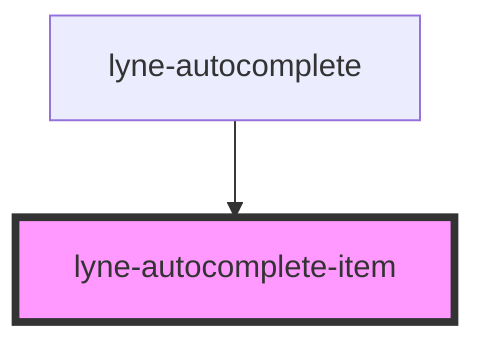

# lyne-autocomplete-item

<!-- Auto Generated Below -->

## Properties

| Property            | Attribute   | Description                                      | Type     | Default     |
| ------------------- | ----------- | ------------------------------------------------ | -------- | ----------- |
| `highlight`         | `highlight` | The text to highlight within the string property | `string` | `undefined` |
| `text` _(required)_ | `text`      | Text to show as content of the autocomplete item | `string` | `undefined` |

## Slots

| Slot          | Description                                            |
| ------------- | ------------------------------------------------------ |
| `"post-text"` | placeholder to put content inline after the item text  |
| `"pre-text"`  | placeholder to put content inline before the item text |

## Dependencies

### Used by

 - [lyne-autocomplete](../lyne-autocomplete)

### Graph

----------------------------------------------

