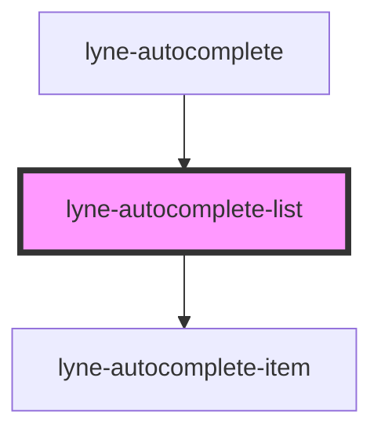

# lyne-autocomplete-list

<!-- Auto Generated Below -->

## Properties

| Property        | Attribute        | Description                                                                                                                                                       | Type      | Default                                                                                                                                                                                                                                                                                                                                                                                                      |
| --------------- | ---------------- | ----------------------------------------------------------------------------------------------------------------------------------------------------------------- | --------- | ------------------------------------------------------------------------------------------------------------------------------------------------------------------------------------------------------------------------------------------------------------------------------------------------------------------------------------------------------------------------------------------------------------ |
| `highlight`     | `highlight`      | The string to search for as highlight in the list items.                                                                                                          | `string`  | `undefined`                                                                                                                                                                                                                                                                                                                                                                                                  |
| `items`         | `items`          | Items to show in the autocomplete interface. You should pass a stringified array of objects, containing the `text` key for each object with an appropriate value. | `string`  | `'[{"text": "pre ipsum item1 post lorem"},{"text": "pre ipsum item2 post lorem"},{"text": "pre ipsum item3 post lorem"},{"text": "pre ipsum item4 post lorem"},{"text": "pre ipsum item5 post lorem"},{"text": "pre ipsum item6 post lorem"},{"text": "pre ipsum item7 post lorem"},{"text": "pre ipsum item8 post lorem"},{"text": "pre ipsum item9 post lorem"},{"text": "pre ipsum item10 post lorem"}]'` |
| `listId`        | `list-id`        | Id to use for the list.                                                                                                                                           | `string`  | `undefined`                                                                                                                                                                                                                                                                                                                                                                                                  |
| `selectedIndex` | `selected-index` | The index of the list item which should be currently selected.                                                                                                    | `number`  | `undefined`                                                                                                                                                                                                                                                                                                                                                                                                  |
| `visible`       | `visible`        | Determine if the list should be visible or not.                                                                                                                   | `boolean` | `false`                                                                                                                                                                                                                                                                                                                                                                                                      |

## Dependencies

### Used by

 - [lyne-autocomplete](../lyne-autocomplete)

### Depends on

- [lyne-autocomplete-item](../lyne-autocomplete-item)

### Graph

----------------------------------------------

