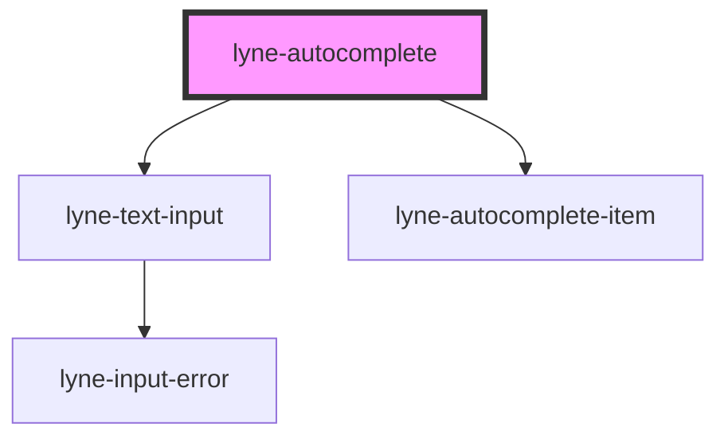

# lyne-autocomplete

<!-- Auto Generated Below -->

## Properties

| Property  | Attribute | Description                                                                                                                                                       | Type      | Default                                                                             |
| --------- | --------- | ----------------------------------------------------------------------------------------------------------------------------------------------------------------- | --------- | ----------------------------------------------------------------------------------- |
| `items`   | `items`   | Items to show in the autocomplete interface. You should pass a stringified array of objects, containing the `text` key for each object with an appropriate value. | `string`  | `'[{"text": "pre ipsum item1 post lorem"},{"text": "pre ipsum item2 post lorem"}]'` |
| `visible` | `visible` | Set if the autocomplete interface should be shown or hidden.                                                                                                      | `boolean` | `true`                                                                              |

## Dependencies

### Depends on

- [lyne-text-input](../lyne-text-input)
- [lyne-autocomplete-item](../lyne-autocomplete-item)

### Graph

----------------------------------------------

