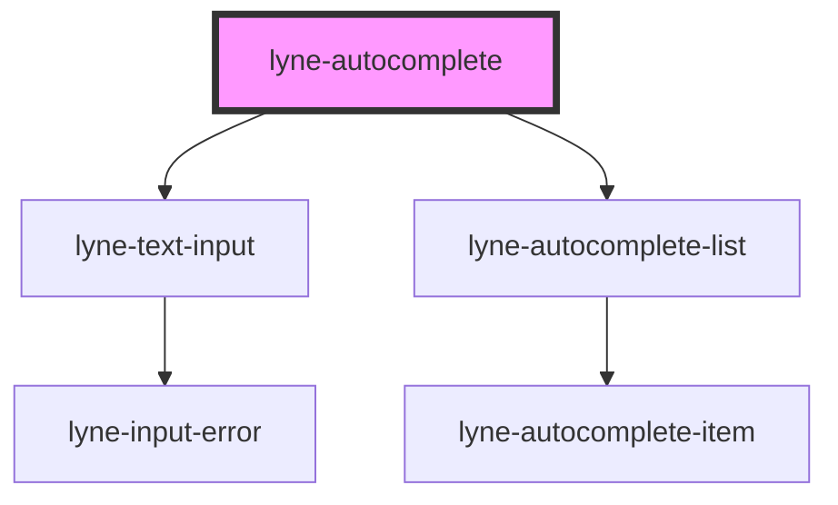

# lyne-autocomplete

<!-- Auto Generated Below -->

## Properties

| Property  | Attribute  | Description                                                                                                                                                       | Type     | Default                                                                                                                                                                                                                                                                                                                                                                                                      |
| --------- | ---------- | ----------------------------------------------------------------------------------------------------------------------------------------------------------------- | -------- | ------------------------------------------------------------------------------------------------------------------------------------------------------------------------------------------------------------------------------------------------------------------------------------------------------------------------------------------------------------------------------------------------------------ |
| `eventId` | `event-id` | Id which is sent as the id in the eventDetail payload                                                                                                             | `string` | `undefined`                                                                                                                                                                                                                                                                                                                                                                                                  |
| `items`   | `items`    | Items to show in the autocomplete interface. You should pass a stringified array of objects, containing the `text` key for each object with an appropriate value. | `string` | `'[{"text": "pre ipsum item1 post lorem"},{"text": "pre ipsum item2 post lorem"},{"text": "pre ipsum item3 post lorem"},{"text": "pre ipsum item4 post lorem"},{"text": "pre ipsum item5 post lorem"},{"text": "pre ipsum item6 post lorem"},{"text": "pre ipsum item7 post lorem"},{"text": "pre ipsum item8 post lorem"},{"text": "pre ipsum item9 post lorem"},{"text": "pre ipsum item10 post lorem"}]'` |
| `value`   | `value`    | The value to use as default value for the input. The input value or the selected autocomplete value is reflected to this attribute.                               | `string` | `undefined`                                                                                                                                                                                                                                                                                                                                                                                                  |

## Dependencies

### Depends on

- [lyne-text-input](../lyne-text-input)
- [lyne-autocomplete-list](../lyne-autocomplete-list)

### Graph

----------------------------------------------

