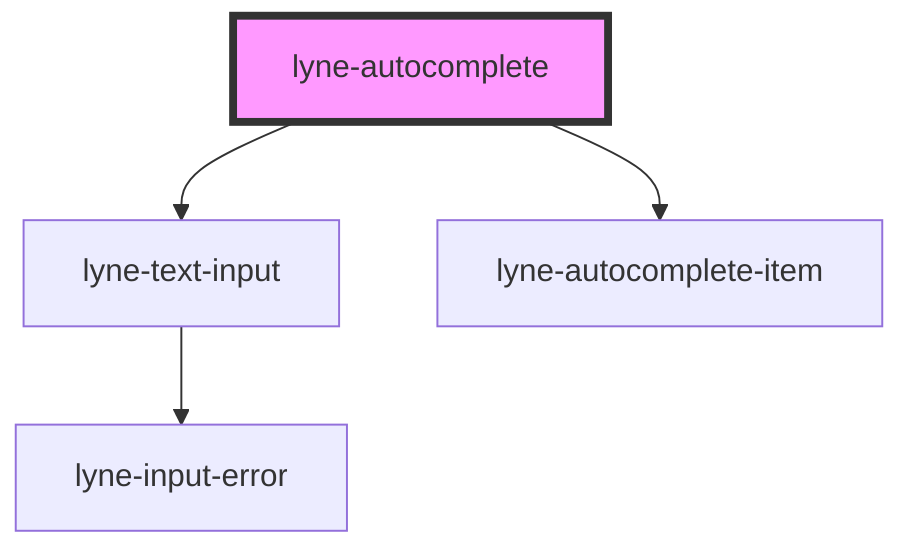

# lyne-autocomplete

<!-- Auto Generated Below -->

## Dependencies

### Depends on

- [lyne-text-input](../lyne-text-input)
- [lyne-autocomplete-item](../lyne-autocomplete-item)

### Graph

----------------------------------------------

