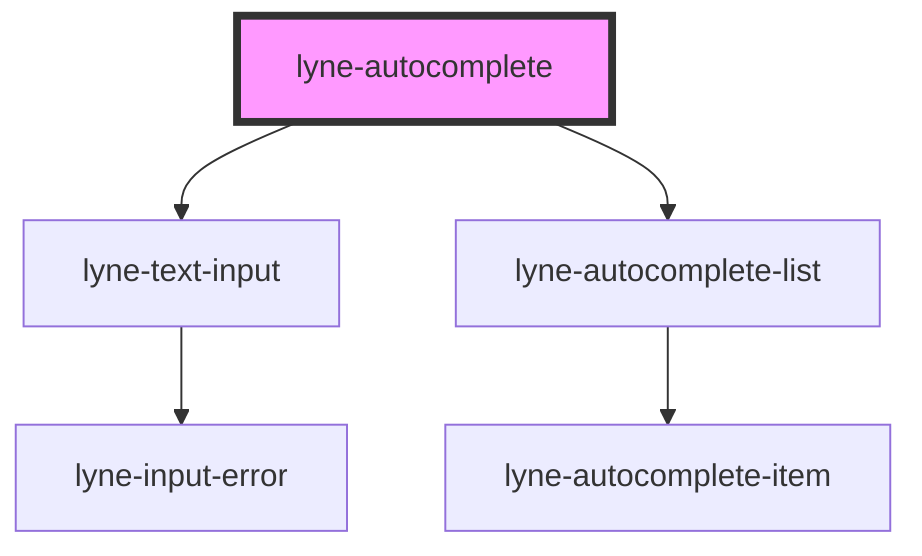

# lyne-autocomplete

<!-- Auto Generated Below -->

## Properties

| Property                  | Attribute                | Description                                                                                                                                                       | Type      | Default               |
| ------------------------- | ------------------------ | ----------------------------------------------------------------------------------------------------------------------------------------------------------------- | --------- | --------------------- |
| `autocompleteId`          | `autocomplete-id`        | Autocomplete id. If you use multiple instances on a page, you should set individual id's to each of them.                                                         | `string`  | `'autocomplete-list'` |
| `eventId`                 | `event-id`               | Id which is sent as the id in the eventDetail payload when a value is selected                                                                                    | `string`  | `undefined`           |
| `inputBorderless`         | `input-borderless`       | Define if borderless variant of autocomplete input should be used. See documentation of lyne-text-input for details.                                              | `boolean` | `undefined`           |
| `inputDebounceTimeout`    | `input-debounce-timeout` | Debounce timeout to use for the input. See documentation of lyne-text-input for details.                                                                          | `number`  | `200`                 |
| `inputLabel` _(required)_ | `input-label`            | Label attribute for the input element. See lyne-text-input for details.                                                                                           | `string`  | `undefined`           |
| `inputLabelVisible`       | `input-label-visible`    | Determine if the input label should be visible. See lyne-text-input for details.                                                                                  | `boolean` | `undefined`           |
| `inputName` _(required)_  | `input-name`             | Name attribute for the input element. See lyne-text-input for details.                                                                                            | `string`  | `undefined`           |
| `inputPlaceholder`        | `input-placeholder`      | Placeholder attribute for the input element. See lyne-text-input for details.                                                                                     | `string`  | `undefined`           |
| `items`                   | `items`                  | Items to show in the autocomplete interface. You should pass a stringified array of objects, containing the `text` key for each object with an appropriate value. | `string`  | `undefined`           |
| `minChars`                | `min-chars`              | Define how many chars a user must type into the input field for the autocomplete list to show up.                                                                 | `number`  | `0`                   |
| `value`                   | `value`                  | The value to use as default value for the input. The input value or the selected autocomplete value is reflected to this attribute.                               | `string`  | `undefined`           |

## Dependencies

### Depends on

- [lyne-text-input](../lyne-text-input)
- [lyne-autocomplete-list](../lyne-autocomplete-list)

### Graph

----------------------------------------------

