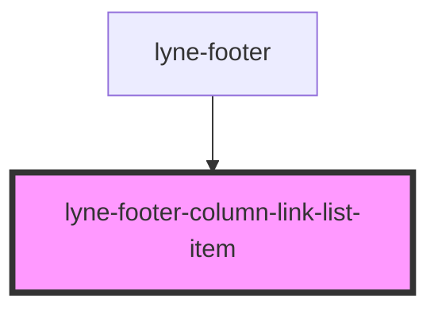

# lyne-footer-column-link-list-item

<!-- Auto Generated Below -->

## Properties

| Property   | Attribute  | Description | Type     | Default     |
| ---------- | ---------- | ----------- | -------- | ----------- |
| `external` | `external` |             | `string` | `undefined` |
| `href`     | `href`     |             | `string` | `undefined` |
| `label`    | `label`    |             | `string` | `undefined` |

## Dependencies

### Used by

 - [lyne-footer](../lyne-footer-container)

### Graph

----------------------------------------------

