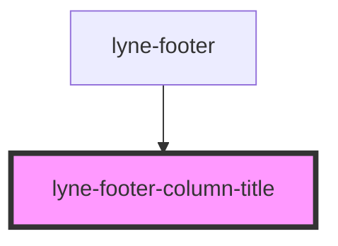

# lyne-footer-column-title

<!-- Auto Generated Below -->

## Properties

| Property      | Attribute     | Description | Type     | Default     |
| ------------- | ------------- | ----------- | -------- | ----------- |
| `columntitle` | `columntitle` |             | `string` | `undefined` |

## Dependencies

### Used by

 - [lyne-footer](../lyne-footer-container)

### Graph

----------------------------------------------

