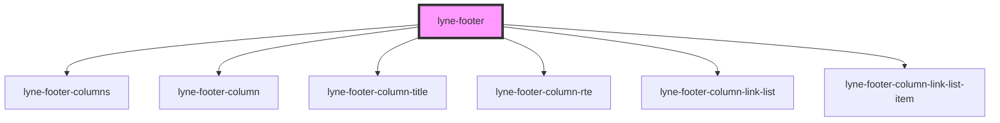

# lyne-footer

<!-- Auto Generated Below -->

## Properties

| Property      | Attribute     | Description | Type     | Default     |
| ------------- | ------------- | ----------- | -------- | ----------- |
| `footertitle` | `footertitle` |             | `string` | `undefined` |

## Dependencies

### Depends on

- [lyne-footer-columns](../lyne-footer-columns)
- [lyne-footer-column](../lyne-footer-column)
- [lyne-footer-column-title](../lyne-footer-column-title)
- [lyne-footer-column-rte](../lyne-footer-column-rte)
- [lyne-footer-column-link-list](../lyne-footer-column-link-list)
- [lyne-footer-column-link-list-item](../lyne-footer-column-link-list-item)

### Graph

----------------------------------------------

