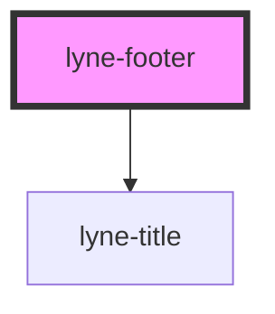

# lyne-footer

<!-- Auto Generated Below -->

## Properties

| Property                          | Attribute             | Description                                                      | Type                              | Default     |
| --------------------------------- | --------------------- | ---------------------------------------------------------------- | --------------------------------- | ----------- |
| `accessibilityTitle` _(required)_ | `accessibility-title` | Footer title text, visually hidden,  necessary for screenreaders | `string`                          | `undefined` |
| `appearance`                      | `appearance`          | Footer appearance                                                | `"primary" \| "primary-negative"` | `'primary'` |

## Dependencies

### Depends on

- [lyne-title](../lyne-title)

### Graph

----------------------------------------------

