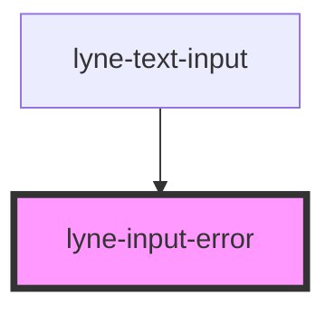

# lyne-input-error

<!-- Auto Generated Below -->

## Properties

| Property               | Attribute | Description                         | Type     | Default     |
| ---------------------- | --------- | ----------------------------------- | -------- | ----------- |
| `message` _(required)_ | `message` | The error message, we want to show. | `string` | `undefined` |

## Dependencies

### Used by

 - [lyne-text-input](../lyne-text-input)

### Graph

----------------------------------------------

