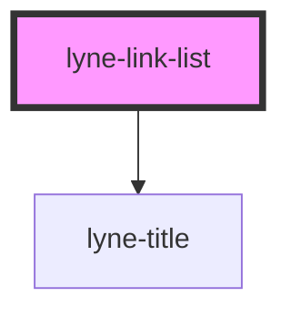

# lyne-link-list

<!-- Auto Generated Below -->

## Properties

| Property     | Attribute     | Description                                    | Type                                     | Default      |
| ------------ | ------------- | ---------------------------------------------- | ---------------------------------------- | ------------ |
| `titleLevel` | `title-level` | The semantic level of the title, e.g. 3 = h3   | `"1" \| "2" \| "3" \| "4" \| "5" \| "6"` | `'2'`        |
| `titleText`  | `title-text`  | The title text we want to show before the list | `string`                                 | `undefined`  |
| `variant`    | `variant`     | Choose the link style variant                  | `"negative" \| "positive"`               | `'positive'` |

## Slots

| Slot        | Description                  |
| ----------- | ---------------------------- |
| `"unnamed"` | Use this to document a slot. |

## Dependencies

### Depends on

- [lyne-title](../lyne-title)

### Graph

----------------------------------------------

