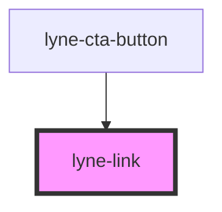

# lyne-link

<!-- Auto Generated Below -->

## Properties

| Property            | Attribute            | Description                                    | Type      | Default     |
| ------------------- | -------------------- | ---------------------------------------------- | --------- | ----------- |
| `link` _(required)_ | `link`               | Link to use as href                            | `string`  | `undefined` |
| `openInNewWindow`   | `open-in-new-window` | If true, target=_blank will be set on the link | `boolean` | `false`     |
| `text` _(required)_ | `text`               | Text to show for the link                      | `string`  | `undefined` |

## Dependencies

### Used by

 - [lyne-cta-button](../lyne-cta-button)

### Graph

----------------------------------------------

