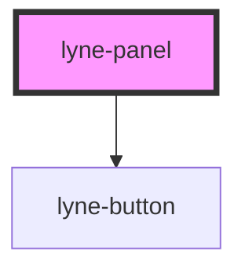

# lyne-panel

<!-- Auto Generated Below -->

## Properties

| Property | Attribute | Description                   | Type     | Default                       |
| -------- | --------- | ----------------------------- | -------- | ----------------------------- |
| `text`   | `text`    | The text to show in the panel | `string` | `'Text inside of the panel.'` |

## Dependencies

### Depends on

- [lyne-button](../lyne-button)

### Graph

----------------------------------------------

