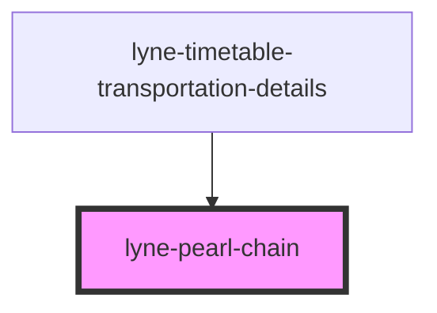

# lyne-pearl-chain

<!-- Auto Generated Below -->

## Properties

| Property            | Attribute           | Description                                                                                                                                                                                                                                                                                                                                                                                        | Type                           | Default     |
| ------------------- | ------------------- | -------------------------------------------------------------------------------------------------------------------------------------------------------------------------------------------------------------------------------------------------------------------------------------------------------------------------------------------------------------------------------------------------- | ------------------------------ | ----------- |
| `disableAnimation`  | `disable-animation` | Per default, the current location has a pulsating animation. You can disable the animation with this property.                                                                                                                                                                                                                                                                                     | `boolean`                      | `undefined` |
| `legs` _(required)_ | `legs`              | Stringified JSON to define the legs of the pearl-chain. Format: `{"legs": [{"cancellation": true, "duration": 25}, ...]}` `duration`: number between 0 and 100. Duration of the leg is relative to the total travel time. Example: departure 16:30, change at 16:40, arrival at 17:00. So the change should have a duration of 33.33%. `cancellation`: if set, the leg will be marked as canceled. | `string`                       | `undefined` |
| `status`            | `status`            | Define, if the pearl-chain represents a connection in the past, in the future or if it is a currently running connection. If it is currently running, provide a number between 0 and 100, which will represent the current location on the pearl-chain.                                                                                                                                            | `"future" \| "past" \| number` | `undefined` |

## Dependencies

### Used by

 - [lyne-timetable-transportation-details](../lyne-timetable-transportation-details)

### Graph

----------------------------------------------

