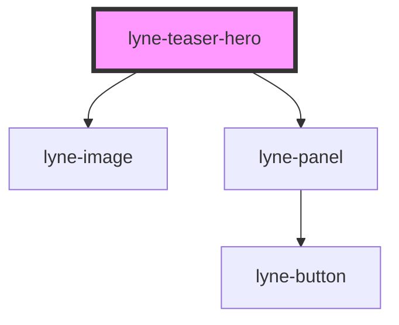

# lyne-teaser-hero

<!-- Auto Generated Below -->

## Properties

| Property                  | Attribute     | Description                                                               | Type     | Default     |
| ------------------------- | ------------- | ------------------------------------------------------------------------- | -------- | ----------- |
| `buttonText` _(required)_ | `button-text` | Button text property for lyne-panel. See lyne-panel for additional info   | `string` | `undefined` |
| `imageSrc` _(required)_   | `image-src`   | Image source property for lyne-image.  See lyne-image for additional info | `string` | `undefined` |
| `text` _(required)_       | `text`        | Text property for lyne-panel. See lyne-panel for additional info          | `string` | `undefined` |

## Dependencies

### Depends on

- [lyne-image](../lyne-image)
- [lyne-panel](../lyne-panel)

### Graph

----------------------------------------------

