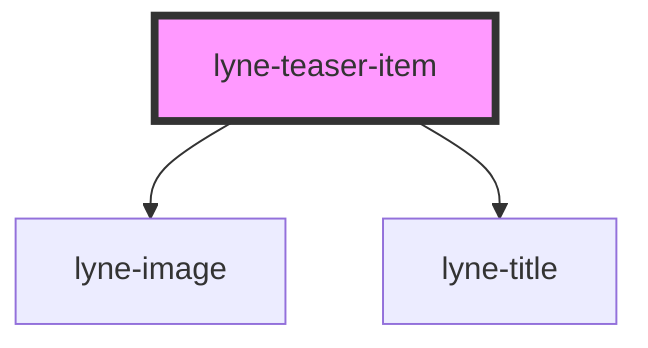

# lyne-teaser-item

<!-- Auto Generated Below -->

## Properties

| Property                 | Attribute       | Description                                                              | Type                                     | Default     |
| ------------------------ | --------------- | ------------------------------------------------------------------------ | ---------------------------------------- | ----------- |
| `imageLoading`           | `image-loading` | Image loading property. See lyne-image for additional info               | `"eager" \| "lazy"`                      | `'eager'`   |
| `imageSrc` _(required)_  | `image-src`     | Image source property for lyne-image. See lyne-image for additional info | `string`                                 | `undefined` |
| `link` _(required)_      | `link`          | Link to open if the teaser is clicked/pressed.                           | `string`                                 | `undefined` |
| `personalised`           | `personalised`  | is teaser item personalised                                              | `boolean`                                | `undefined` |
| `text` _(required)_      | `text`          | Text property for lyne-panel. See lyne-panel for additional info         | `string`                                 | `undefined` |
| `titleLevel`             | `title-level`   | The semantic level of the title, e.g. 3 = h3                             | `"1" \| "2" \| "3" \| "4" \| "5" \| "6"` | `'5'`       |
| `titleText` _(required)_ | `title-text`    | Headline property                                                        | `string`                                 | `undefined` |

## Dependencies

### Depends on

- [lyne-image](../lyne-image)
- [lyne-title](../lyne-title)

### Graph

----------------------------------------------

