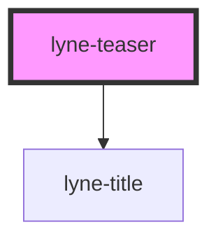

# lyne-teaser-thumbnail

<!-- Auto Generated Below -->

## Properties

| Property                          | Attribute              | Description                                                                                                                                                                        | Type                              | Default     |
| --------------------------------- | ---------------------- | ---------------------------------------------------------------------------------------------------------------------------------------------------------------------------------- | --------------------------------- | ----------- |
| `accessibilityLabel` _(required)_ | `accessibility-label`  | The text which gets exposed to screen reader users. The text should reflect all the information  Example text: Connection from X to Y, via Z, on date X. Ticket price starts at X. | `string`                          | `undefined` |
| `appearance`                      | `appearance`           | Teaser appearance                                                                                                                                                                  | `"primary" \| "primary-negative"` | `'primary'` |
| `description` _(required)_        | `description`          | The description attribute                                                                                                                                                          | `""`                              | `undefined` |
| `headline` _(required)_           | `headline`             | The headline attribute                                                                                                                                                             | `""`                              | `undefined` |
| `hrefValue` _(required)_          | `href-value`           | The href value you want to link to                                                                                                                                                 | `string`                          | `undefined` |
| `imgAlt` _(required)_             | `img-alt`              | The image alt                                                                                                                                                                      | `string`                          | `undefined` |
| `imgSrc` _(required)_             | `img-src`              | The image src                                                                                                                                                                      | `string`                          | `undefined` |
| `isStacked`                       | `is-stacked`           | Teaser variant - when this is true the text-content will be under the image otherwise it will be displayed next to the image                                                       | `boolean`                         | `undefined` |
| `pictureSizesConfig`              | `picture-sizes-config` | We would use this Prop if the margin and the aspect-ratio of the lyne-image is customizable                                                                                        | `string`                          | `undefined` |

## Dependencies

### Depends on

- [lyne-title](../lyne-title)

### Graph

----------------------------------------------

