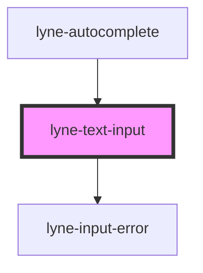

# lyne-text-input

<!-- Auto Generated Below -->

## Properties

| Property                 | Attribute                   | Description                                                                                                                                                                                   | Type                                                                                                                                                                                                                                                                                                                                                                                                                                                                                                                                                                                                                                                                                                                                                                                                                                                                                                                        | Default     |
| ------------------------ | --------------------------- | --------------------------------------------------------------------------------------------------------------------------------------------------------------------------------------------- | --------------------------------------------------------------------------------------------------------------------------------------------------------------------------------------------------------------------------------------------------------------------------------------------------------------------------------------------------------------------------------------------------------------------------------------------------------------------------------------------------------------------------------------------------------------------------------------------------------------------------------------------------------------------------------------------------------------------------------------------------------------------------------------------------------------------------------------------------------------------------------------------------------------------------- | ----------- |
| `borderless`             | `borderless`                | If set to true, the input element will have no border, but a drop shadow.                                                                                                                     | `boolean`                                                                                                                                                                                                                                                                                                                                                                                                                                                                                                                                                                                                                                                                                                                                                                                                                                                                                                                   | `false`     |
| `debounceInputEvent`     | `debounce-input-event`      | Debounce type for the input change event in ms. If you set this value to e.g. 300, we fire the input event only every 300ms.                                                                  | `number`                                                                                                                                                                                                                                                                                                                                                                                                                                                                                                                                                                                                                                                                                                                                                                                                                                                                                                                    | `0`         |
| `eventId`                | `event-id`                  | Id which is sent as the id in the eventDetail payload                                                                                                                                         | `string`                                                                                                                                                                                                                                                                                                                                                                                                                                                                                                                                                                                                                                                                                                                                                                                                                                                                                                                    | `undefined` |
| `icon`                   | `icon`                      | The icon name we want to use, choose from the small icon variants from the ui-icons category from here https://lyne.sbb.ch/tokens/icons/.                                                     | `string`                                                                                                                                                                                                                                                                                                                                                                                                                                                                                                                                                                                                                                                                                                                                                                                                                                                                                                                    | `undefined` |
| `inputAriaAutocomplete`  | `input-aria-autocomplete`   | The aria-autocomplete attribute for the input element.                                                                                                                                        | `"both" \| "inline" \| "list" \| "none"`                                                                                                                                                                                                                                                                                                                                                                                                                                                                                                                                                                                                                                                                                                                                                                                                                                                                                    | `undefined` |
| `inputAriaControls`      | `input-aria-controls`       | The id to use as the aira-controls attribute for the input element.                                                                                                                           | `string`                                                                                                                                                                                                                                                                                                                                                                                                                                                                                                                                                                                                                                                                                                                                                                                                                                                                                                                    | `undefined` |
| `inputAriaExpanded`      | `input-aria-expanded`       | Set aria-expanded on the input element.                                                                                                                                                       | `boolean`                                                                                                                                                                                                                                                                                                                                                                                                                                                                                                                                                                                                                                                                                                                                                                                                                                                                                                                   | `false`     |
| `inputAutoCompleteValue` | `input-auto-complete-value` | Choose either on, off or one of the existing autocomplete values. Read more about them here: https://mzl.la/3wpfaDV                                                                           | `"additional-name" \| "address-level1" \| "address-level2" \| "address-level3" \| "address-level4" \| "address-line1" \| "address-line2" \| "address-line3" \| "bday" \| "bday-day" \| "bday-month" \| "bday-year" \| "cc-additional-name" \| "cc-csc" \| "cc-exp" \| "cc-exp-month" \| "cc-exp-year" \| "cc-family-name" \| "cc-given-name" \| "cc-name" \| "cc-number" \| "cc-type" \| "country" \| "country-name" \| "current-password" \| "email" \| "family-name" \| "given-name" \| "honorific-prefix" \| "honorific-suffix" \| "impp" \| "language" \| "name" \| "new-password" \| "nickname" \| "off" \| "on" \| "one-time-code" \| "organization" \| "organization-title" \| "photo" \| "postal-code" \| "sex" \| "street-address" \| "tel" \| "tel-area-code" \| "tel-country-code" \| "tel-extension" \| "tel-local" \| "tel-national" \| "transaction-amount" \| "transaction-currency" \| "url" \| "username"` | `undefined` |
| `inputDisabled`          | `input-disabled`            | If set to true, the input field will be disabled.                                                                                                                                             | `boolean`                                                                                                                                                                                                                                                                                                                                                                                                                                                                                                                                                                                                                                                                                                                                                                                                                                                                                                                   | `undefined` |
| `inputError`             | `input-error`               | If set to true, we will set an an error message for the current input field.                                                                                                                  | `boolean`                                                                                                                                                                                                                                                                                                                                                                                                                                                                                                                                                                                                                                                                                                                                                                                                                                                                                                                   | `undefined` |
| `inputId`                | `input-id`                  | Each input needs to have an individual id. If no id is provided, the component will create a unique id by itself.                                                                             | `string`                                                                                                                                                                                                                                                                                                                                                                                                                                                                                                                                                                                                                                                                                                                                                                                                                                                                                                                    | `undefined` |
| `inputMaxLength`         | `input-max-length`          | Pass on a expected max length.                                                                                                                                                                | `number`                                                                                                                                                                                                                                                                                                                                                                                                                                                                                                                                                                                                                                                                                                                                                                                                                                                                                                                    | `undefined` |
| `inputMinLength`         | `input-min-length`          | Pass on a expected min length.                                                                                                                                                                | `number`                                                                                                                                                                                                                                                                                                                                                                                                                                                                                                                                                                                                                                                                                                                                                                                                                                                                                                                    | `undefined` |
| `inputName` _(required)_ | `input-name`                | Each input should have an individual name.                                                                                                                                                    | `string`                                                                                                                                                                                                                                                                                                                                                                                                                                                                                                                                                                                                                                                                                                                                                                                                                                                                                                                    | `undefined` |
| `inputPattern`           | `input-pattern`             | Add a validation pattern (regex) the input should follow. Read more here: https://mzl.la/3C3HTiG                                                                                              | `string`                                                                                                                                                                                                                                                                                                                                                                                                                                                                                                                                                                                                                                                                                                                                                                                                                                                                                                                    | `undefined` |
| `inputPlaceholder`       | `input-placeholder`         | Add a placeholder to show what kind of input is expected.                                                                                                                                     | `string`                                                                                                                                                                                                                                                                                                                                                                                                                                                                                                                                                                                                                                                                                                                                                                                                                                                                                                                    | `undefined` |
| `inputRequired`          | `input-required`            | If set to true, an input in this field will be required.                                                                                                                                      | `boolean`                                                                                                                                                                                                                                                                                                                                                                                                                                                                                                                                                                                                                                                                                                                                                                                                                                                                                                                   | `undefined` |
| `inputRole`              | `input-role`                | The role attribute used for the input element.                                                                                                                                                | `"combobox" \| "listbox" \| "presentation" \| "searchbox"`                                                                                                                                                                                                                                                                                                                                                                                                                                                                                                                                                                                                                                                                                                                                                                                                                                                                  | `undefined` |
| `inputType` _(required)_ | `input-type`                | Define which input type you would like to use. Read more about the individual advantages here, most of the are related to show the user the most convienient keyboard: https://bit.ly/3wuQE47 | `string`                                                                                                                                                                                                                                                                                                                                                                                                                                                                                                                                                                                                                                                                                                                                                                                                                                                                                                                    | `undefined` |
| `inputValue`             | `input-value`               | Value for the input element.                                                                                                                                                                  | `string`                                                                                                                                                                                                                                                                                                                                                                                                                                                                                                                                                                                                                                                                                                                                                                                                                                                                                                                    | `undefined` |
| `label` _(required)_     | `label`                     | Each input element needs to have a label associated with it.                                                                                                                                  | `string`                                                                                                                                                                                                                                                                                                                                                                                                                                                                                                                                                                                                                                                                                                                                                                                                                                                                                                                    | `undefined` |
| `labelVisible`           | `label-visible`             | If set to false, the label will be visually hidden but still be in the markup to provide proper semantics                                                                                     | `boolean`                                                                                                                                                                                                                                                                                                                                                                                                                                                                                                                                                                                                                                                                                                                                                                                                                                                                                                                   | `true`      |

## Slots

| Slot     | Description                                  |
| -------- | -------------------------------------------- |
| `"icon"` | Slot used to display the icon, if one is set |

## Dependencies

### Used by

 - [lyne-autocomplete](../lyne-autocomplete)

### Depends on

- [lyne-input-error](../lyne-input-error)

### Graph

----------------------------------------------

