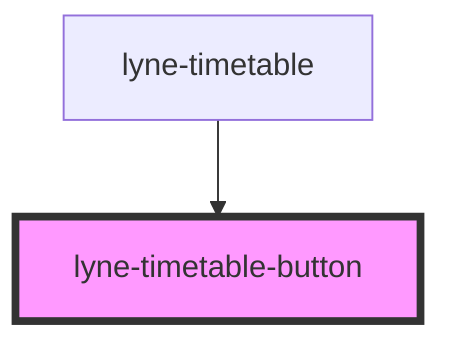

# lyne-timetable-button

<!-- Auto Generated Below -->

## Properties

| Property     | Attribute    | Description                                                                                   | Type                                                                  | Default                 |
| ------------ | ------------ | --------------------------------------------------------------------------------------------- | --------------------------------------------------------------------- | ----------------------- |
| `appearance` | `appearance` | appearance of the Timetable Button, can either be used on level 1 or level 2 of the timetable | `"cus-him" \| "earlier-connections" \| "later-connections" \| "walk"` | `'earlier-connections'` |
| `eventId`    | `event-id`   | Id which is sent in the click event payload                                                   | `string`                                                              | `undefined`             |
| `name`       | `name`       | The name attribute to use for the button                                                      | `string`                                                              | `undefined`             |

## Slots

| Slot        | Description                  |
| ----------- | ---------------------------- |
| `"cus-him"` | Use this to document a slot. |

## Dependencies

### Used by

 - [lyne-timetable](../lyne-timetable)

### Graph

----------------------------------------------

