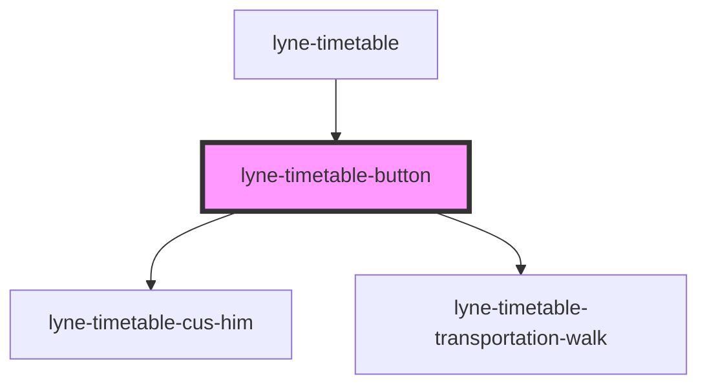

# lyne-timetable-button

<!-- Auto Generated Below -->

## Properties

| Property     | Attribute    | Description                                                                                                     | Type                                                                  | Default                 |
| ------------ | ------------ | --------------------------------------------------------------------------------------------------------------- | --------------------------------------------------------------------- | ----------------------- |
| `appearance` | `appearance` | Set the desired appearance of the component.                                                                    | `"cus-him" \| "earlier-connections" \| "later-connections" \| "walk"` | `'earlier-connections'` |
| `config`     | `config`     | If appearance is set to 'cus-him' or 'walk', we need to provide a config to popultate the nested web component. | `string`                                                              | `undefined`             |
| `eventId`    | `event-id`   | Id which is sent in the click event payload                                                                     | `string`                                                              | `undefined`             |
| `expanded`   | `expanded`   | Set to true to initially show the state, which would get set by pressing the button.                            | `boolean`                                                             | `undefined`             |
| `name`       | `name`       | The name attribute to use for the button                                                                        | `string`                                                              | `undefined`             |

## Dependencies

### Used by

 - [lyne-timetable](../lyne-timetable)

### Depends on

- [lyne-timetable-cus-him](../lyne-timetable-cus-him)
- [lyne-timetable-transportation-walk](../lyne-timetable-transportation-walk)

### Graph

----------------------------------------------

