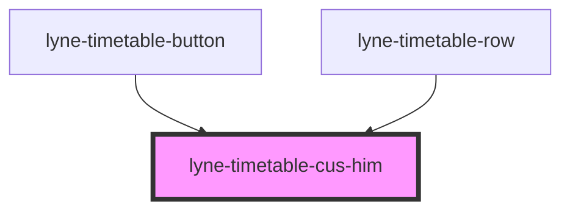

# lyne-timetable-cus-him

<!-- Auto Generated Below -->

## Properties

| Property              | Attribute    | Description                                                                                                                                                                                                                                                                                              | Type                                                                                           | Default              |
| --------------------- | ------------ | -------------------------------------------------------------------------------------------------------------------------------------------------------------------------------------------------------------------------------------------------------------------------------------------------------- | ---------------------------------------------------------------------------------------------- | -------------------- |
| `appearance`          | `appearance` | appearance of the Cus Him display, can either be an icon only list appearance or a single icon with text                                                                                                                                                                                                 | `"first-level-list" \| "second-level-button" \| "second-level-list" \| "second-level-message"` | `'first-level-list'` |
| `config` _(required)_ | `config`     | Stringified JSON to define the different outputs of the occupancy predicition cell. Format: occupancyItems: [ {    class: '1',    icon: "<svg width="19" height="16"...></svg>",,    occupancy: 'low' }, {    class: '2',    icon: "<svg width="19" height="16"...></svg>",,    occupancy: 'medium'  } ] | `string`                                                                                       | `undefined`          |

## Dependencies

### Used by

 - [lyne-timetable-button](../lyne-timetable-button)
 - [lyne-timetable-row](../lyne-timetable-row)

### Graph

----------------------------------------------

