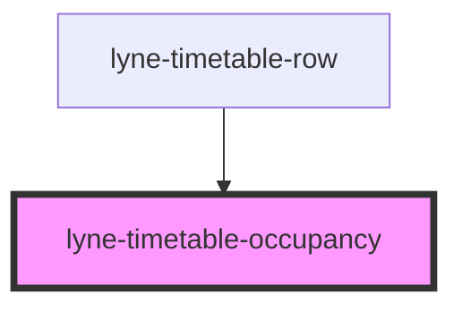

# lyne-timetable-occupancy

<!-- Auto Generated Below -->

## Properties

| Property              | Attribute | Description                                                                                                                               | Type     | Default     |
| --------------------- | --------- | ----------------------------------------------------------------------------------------------------------------------------------------- | -------- | ----------- |
| `config` _(required)_ | `config`  | Stringified JSON which defines most of the content of the component. Please check the individual stories to get an idea of the structure. | `string` | `undefined` |

## Dependencies

### Used by

 - [lyne-timetable-row](../lyne-timetable-row)

### Graph

----------------------------------------------

