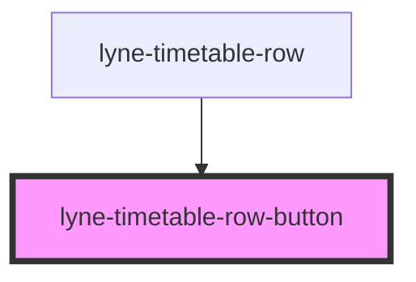

# lyne-timetable-row-button

<!-- Auto Generated Below -->

## Properties

| Property   | Attribute   | Description                                                                          | Type               | Default     |
| ---------- | ----------- | ------------------------------------------------------------------------------------ | ------------------ | ----------- |
| `eventId`  | `event-id`  | Id which is sent in the event of clicking the button                                 | `string`           | `undefined` |
| `expanded` | `expanded`  | Set to true to initially show the state, which would get set by pressing the button. | `boolean`          | `undefined` |
| `someProp` | `some-prop` | Documentation for someProp                                                           | `"opt1" \| "opt2"` | `undefined` |

## Dependencies

### Used by

 - [lyne-timetable-row](../lyne-timetable-row)

### Graph

----------------------------------------------

