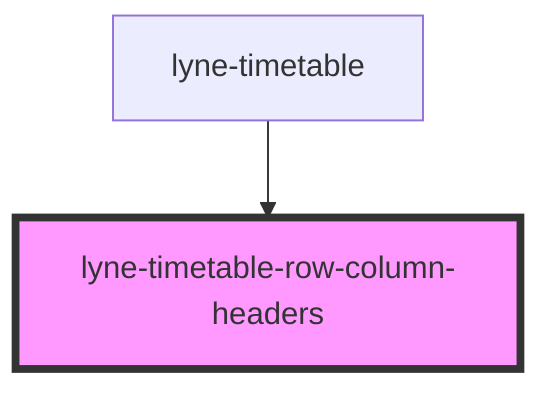

# lyne-timetable-row-column-headers

<!-- Auto Generated Below -->

## Properties

| Property              | Attribute | Description | Type     | Default     |
| --------------------- | --------- | ----------- | -------- | ----------- |
| `config` _(required)_ | `config`  |             | `string` | `undefined` |

## Dependencies

### Used by

 - [lyne-timetable](../lyne-timetable)

### Graph

----------------------------------------------

