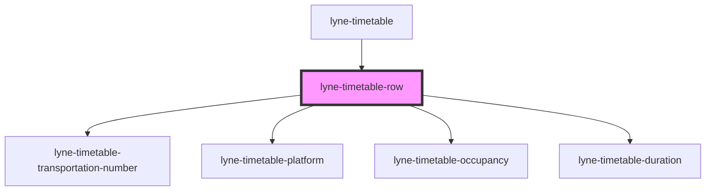

# lyne-timetable-row

<!-- Auto Generated Below -->

## Properties

| Property              | Attribute | Description                                                                                                                                                                                                                                                                                              | Type     | Default     |
| --------------------- | --------- | -------------------------------------------------------------------------------------------------------------------------------------------------------------------------------------------------------------------------------------------------------------------------------------------------------- | -------- | ----------- |
| `config` _(required)_ | `config`  | Stringified JSON to define the different outputs of the occupancy predicition cell. Format: occupancyItems: [ {    class: '1',    icon: "<svg width="19" height="16"...></svg>",,    occupancy: 'low' }, {    class: '2',    icon: "<svg width="19" height="16"...></svg>",,    occupancy: 'medium'  } ] | `string` | `undefined` |

## Dependencies

### Used by

 - [lyne-timetable](../lyne-timetable)

### Depends on

- [lyne-timetable-transportation-number](../lyne-timetable-transportation-number)
- [lyne-timetable-platform](../lyne-timetable-platform)
- [lyne-timetable-occupancy](../lyne-timetable-occupancy)
- [lyne-timetable-duration](../lyne-timetable-duration)

### Graph

----------------------------------------------

