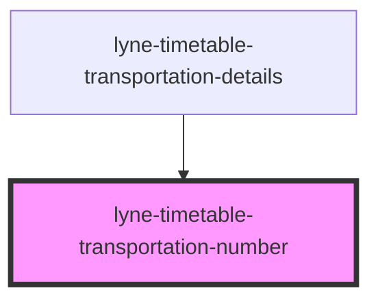

# lyne-timetable-transportation-number

<!-- Auto Generated Below -->

## Properties

| Property              | Attribute    | Description                                                                                                                                                                                                                                                                                            | Type                              | Default         |
| --------------------- | ------------ | ------------------------------------------------------------------------------------------------------------------------------------------------------------------------------------------------------------------------------------------------------------------------------------------------------ | --------------------------------- | --------------- |
| `appearance`          | `appearance` | appearance of the Transportation number display, can either be used on level 1 or level 2 of the timetable                                                                                                                                                                                             | `"first-level" \| "second-level"` | `'first-level'` |
| `config` _(required)_ | `config`     | Stringified JSON to define the different outputs of the transportations number cell. Format: {  "direction": "Richtung Bern Wankdorf, Bahnhof",  "meansOfTransport": {    "picto": "<svg width=\"24\" height=\"24\"...></svg>",    "text": "Bus"  },  "product":{    "icon": "",    "text":"B 20"  } } | `string`                          | `undefined`     |

## Dependencies

### Used by

 - [lyne-timetable-transportation-details](../lyne-timetable-transportation-details)

### Graph

----------------------------------------------

