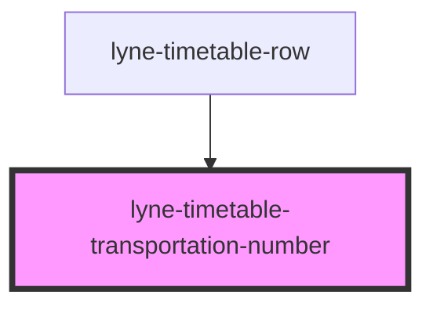

# lyne-timetable-transportation-number

<!-- Auto Generated Below -->

## Properties

| Property              | Attribute | Description                                                                                                                                                                                                                                                                                            | Type     | Default     |
| --------------------- | --------- | ------------------------------------------------------------------------------------------------------------------------------------------------------------------------------------------------------------------------------------------------------------------------------------------------------ | -------- | ----------- |
| `config` _(required)_ | `config`  | Stringified JSON to define the different outputs of the transportations number cell. Format: {  "direction": "Richtung Bern Wankdorf, Bahnhof",  "meansOfTransport": {    "picto": "<svg width=\"24\" height=\"24\"...></svg>",    "text": "Bus"  },  "product":{    "icon": "",    "text":"B 20"  } } | `string` | `undefined` |

## Dependencies

### Used by

 - [lyne-timetable-row](../lyne-timetable-row)

### Graph

----------------------------------------------

