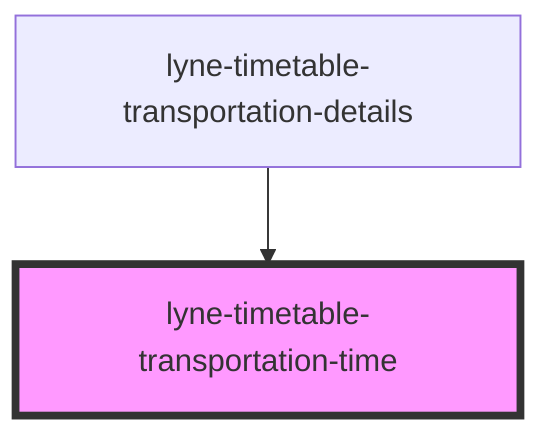

# lyne-timetable-transportation-time

<!-- Auto Generated Below -->

## Properties

| Property              | Attribute    | Description                                                                                                                               | Type                              | Default         |
| --------------------- | ------------ | ----------------------------------------------------------------------------------------------------------------------------------------- | --------------------------------- | --------------- |
| `appearance`          | `appearance` | Set the desired appearance of the module.                                                                                                 | `"first-level" \| "second-level"` | `'first-level'` |
| `config` _(required)_ | `config`     | Stringified JSON which defines most of the content of the component. Please check the individual stories to get an idea of the structure. | `string`                          | `undefined`     |

## Dependencies

### Used by

 - [lyne-timetable-transportation-details](../lyne-timetable-transportation-details)

### Graph

----------------------------------------------

