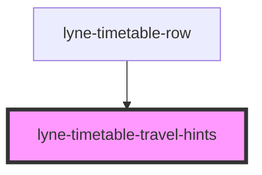

# lyne-timetable-travel-hints

<!-- Auto Generated Below -->

## Properties

| Property              | Attribute    | Description                                                                                                                                                                                                                                                                                              | Type                                        | Default              |
| --------------------- | ------------ | -------------------------------------------------------------------------------------------------------------------------------------------------------------------------------------------------------------------------------------------------------------------------------------------------------- | ------------------------------------------- | -------------------- |
| `appearance`          | `appearance` | appearance of the Travel Hints display, can either be used on level 1 or level 2 of the timetable                                                                                                                                                                                                        | `"first-level-list" \| "second-level-list"` | `'first-level-list'` |
| `config` _(required)_ | `config`     | Stringified JSON to define the different outputs of the occupancy predicition cell. Format: occupancyItems: [ {    class: '1',    icon: "<svg width="19" height="16"...></svg>",,    occupancy: 'low' }, {    class: '2',    icon: "<svg width="19" height="16"...></svg>",,    occupancy: 'medium'  } ] | `string`                                    | `undefined`          |

## Dependencies

### Used by

 - [lyne-timetable-row](../lyne-timetable-row)

### Graph

----------------------------------------------

