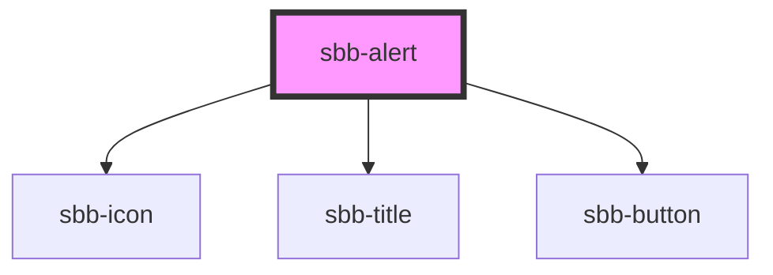

# sbb-alert

<!-- Auto Generated Below -->

## Properties

| Property             | Attribute              | Description                                                                                                                                                                     | Type                                     | Default       |
| -------------------- | ---------------------- | ------------------------------------------------------------------------------------------------------------------------------------------------------------------------------- | ---------------------------------------- | ------------- |
| `ariaLivePoliteness` | `aria-live-politeness` | Aria-live politeness defines how to announce the alert to the user. Choose between `off`, `polite` and `assertive`. As the role `alert` is applied too, default is `assertive`. | `"assertive" \| "off" \| "polite"`       | `'assertive'` |
| `disableAnimation`   | `disable-animation`    | Whether the fade in animation should be disabled.                                                                                                                               | `boolean`                                | `false`       |
| `iconName`           | `icon-name`            | Name of the icon which will be forward to the nested `sbb-icon`. Choose the icons from https://lyne.sbb.ch/tokens/icons/. Styling is optimized for icons of type HIM-CUS.       | `string`                                 | `'info'`      |
| `readonly`           | `readonly`             | Whether the alert is readonly. In readonly mode, there is no dismiss button offered to the user.                                                                                | `boolean`                                | `false`       |
| `size`               | `size`                 | You can choose between `m` or `l` size.                                                                                                                                         | `"l" \| "m"`                             | `'m'`         |
| `titleLevel`         | `title-level`          | Level of title, will be rendered as heading tag (e.g. h5)                                                                                                                       | `"1" \| "2" \| "3" \| "4" \| "5" \| "6"` | `'3'`         |
| `titleValue`         | `title-value`          | Title text                                                                                                                                                                      | `string`                                 | `undefined`   |

## Events

| Event                    | Description                                                        | Type                |
| ------------------------ | ------------------------------------------------------------------ | ------------------- |
| `sbb-alert_did-dismiss`  | Emits when the alert was hidden.                                   | `CustomEvent<void>` |
| `sbb-alert_did-present`  | Emits when the fade in animation ends and the button is displayed. | `CustomEvent<void>` |
| `sbb-alert_will-present` | Emits when the fade in animation starts.                           | `CustomEvent<void>` |

## Methods

### `dismiss() => Promise<void>`

Dismiss the alert.

#### Returns

Type: `Promise<void>`

### `present() => Promise<void>`

Present the alert.

#### Returns

Type: `Promise<void>`

## Slots

| Slot        | Description                                                |
| ----------- | ---------------------------------------------------------- |
| `"icon"`    | Should be a sbb-icon which is displayed next to the title. |
| `"title"`   | Title content.                                             |
| `"unnamed"` | Content of the alert.                                      |

## Dependencies

### Depends on

- [sbb-icon](../sbb-icon)
- [sbb-title](../sbb-title)
- [sbb-button](../sbb-button)

### Graph

----------------------------------------------

