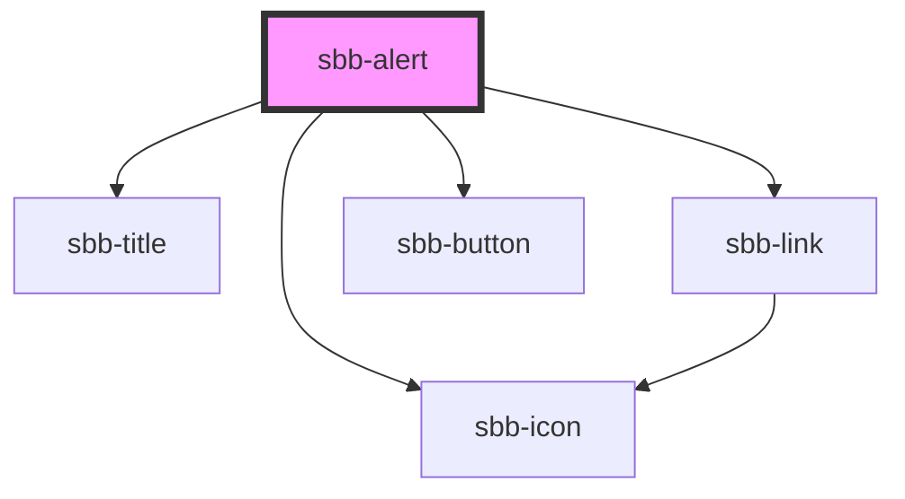

# sbb-alert

The alert component should be used to display important messages to a client. 
There are two sizes available and a `sbb-alert` can optionally be hidden by a user. 
It's possible to place an action, which by clicking navigates somewhere to display more information.

Hint: 
Hiding the alert by a user does not remove it from the DOM, this would be in responsibility
of the library consumer to do it by reacting to the specific event.
However, after closing, a "display: none" style to hide it from screen readers is being added.

## Usage

Default:

```html
<sbb-alert title-content='Interruption between Berne and Olten' icon-name='disruption'>
  Between Bern and Olten from 03.11.2021 to 05.12.2022 each time from 22:30 to 06:00 o'clock 
  construction work will take place. 
  You have to expect changed travel times and changed connections. <sbb-link href="#">Show more</sbb-link>
</sbb-alert>
```

Slot variant:

```html
<sbb-alert>
  <span slot='title'>Interruption between Berne and Olten</span>
  <sbb-icon slot='icon' name='disruption'></sbb-icon>
  Between Bern and Olten from 03.11.2021 to 05.12.2022 each time from 22:30 to 06:00 o'clock 
  construction work will take place. 
  You have to expect changed travel times and changed connections. <sbb-link href="#">Show more</sbb-link>
</sbb-alert>
```

## Accessibility

You can control the aria-live value to define on how to announce the alert to a user.
If there is more than one alert, we recommend to wrap it in a container with a hidden
heading tag for screen reader users.


<!-- Auto Generated Below -->


## Properties

| Property                   | Attribute                   | Description                                                                                                                                                                     | Type                                     | Default       |
| -------------------------- | --------------------------- | ------------------------------------------------------------------------------------------------------------------------------------------------------------------------------- | ---------------------------------------- | ------------- |
| `accessibilityDescribedby` | `accessibility-describedby` | This will be forwarded as aria-describedby to the relevant nested element.                                                                                                      | `string`                                 | `undefined`   |
| `accessibilityLabel`       | `accessibility-label`       | This will be forwarded as aria-label to the relevant nested element.                                                                                                            | `string`                                 | `undefined`   |
| `accessibilityLabelledby`  | `accessibility-labelledby`  | This will be forwarded as aria-labelledby to the relevant nested element.                                                                                                       | `string`                                 | `undefined`   |
| `ariaLivePoliteness`       | `aria-live-politeness`      | Aria-live politeness defines how to announce the alert to the user. Choose between `off`, `polite` and `assertive`. As the role `alert` is applied too, default is `assertive`. | `"assertive" \| "off" \| "polite"`       | `'assertive'` |
| `disableAnimation`         | `disable-animation`         | Whether the fade in animation should be disabled.                                                                                                                               | `boolean`                                | `false`       |
| `href`                     | `href`                      | The href value you want to link to.                                                                                                                                             | `string`                                 | `undefined`   |
| `iconName`                 | `icon-name`                 | Name of the icon which will be forward to the nested `sbb-icon`. Choose the icons from https://lyne.sbb.ch/tokens/icons/. Styling is optimized for icons of type HIM-CUS.       | `string`                                 | `'info'`      |
| `linkContent`              | `link-content`              | Content of the link                                                                                                                                                             | `string`                                 | `undefined`   |
| `readonly`                 | `readonly`                  | Whether the alert is readonly. In readonly mode, there is no dismiss button offered to the user.                                                                                | `boolean`                                | `false`       |
| `rel`                      | `rel`                       | The relationship of the linked URL as space-separated link types.                                                                                                               | `string`                                 | `undefined`   |
| `size`                     | `size`                      | You can choose between `m` or `l` size.                                                                                                                                         | `"l" \| "m"`                             | `'m'`         |
| `target`                   | `target`                    | Where to display the linked URL.                                                                                                                                                | `string`                                 | `undefined`   |
| `titleContent`             | `title-content`             | Content of title.                                                                                                                                                               | `string`                                 | `undefined`   |
| `titleLevel`               | `title-level`               | Level of title, will be rendered as heading tag (e.g. h3). Defaults to level 3.                                                                                                 | `"1" \| "2" \| "3" \| "4" \| "5" \| "6"` | `'3'`         |


## Events

| Event                    | Description                                                        | Type                |
| ------------------------ | ------------------------------------------------------------------ | ------------------- |
| `sbb-alert_did-dismiss`  | Emits when the alert was hidden.                                   | `CustomEvent<void>` |
| `sbb-alert_did-present`  | Emits when the fade in animation ends and the button is displayed. | `CustomEvent<void>` |
| `sbb-alert_will-present` | Emits when the fade in animation starts.                           | `CustomEvent<void>` |


## Methods

### `dismiss() => Promise<void>`

Dismiss the alert.

#### Returns

Type: `Promise<void>`


### `present() => Promise<void>`

Present the alert.

#### Returns

Type: `Promise<void>`


## Slots

| Slot        | Description                                                                                                |
| ----------- | ---------------------------------------------------------------------------------------------------------- |
| `"icon"`    | Should be a sbb-icon which is displayed next to the title. Styling is optimized for icons of type HIM-CUS. |
| `"title"`   | Title content.                                                                                             |
| `"unnamed"` | Content of the alert.                                                                                      |


## Dependencies

### Depends on

- [sbb-icon](../sbb-icon)
- [sbb-title](../sbb-title)
- [sbb-link](../sbb-link)
- [sbb-button](../sbb-button)

### Graph


----------------------------------------------


