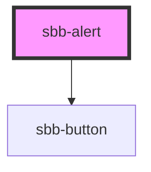

# sbb-alert

<!-- Auto Generated Below -->

## Properties

| Property             | Attribute              | Description                                                                                                                                                                     | Type                               | Default                   |
| -------------------- | ---------------------- | ------------------------------------------------------------------------------------------------------------------------------------------------------------------------------- | ---------------------------------- | ------------------------- |
| `ariaLivePoliteness` | `aria-live-politeness` | Aria-live politeness defines how to announce the alert to the user. Choose between `off`, `polite` and `assertive`. As the role `alert` is applied too, default is `assertive`. | `"assertive" \| "off" \| "polite"` | `'assertive'`             |
| `disableAnimation`   | `disable-animation`    | Whether the fade in animation should be disabled.                                                                                                                               | `boolean`                          | `false`                   |
| `internalId`         | `id`                   |                                                                                                                                                                                 | `string`                           | ``sbb-alert-${++nextId}`` |
| `readonly`           | `readonly`             | Whether the alert is readonly. In readonly mode, there is no dismiss button offered to the user.                                                                                | `boolean`                          | `false`                   |
| `size`               | `size`                 | You can choose between `m` or `l` size.                                                                                                                                         | `"l" \| "m"`                       | `'m'`                     |

## Events

| Event                    | Description                                                        | Type                |
| ------------------------ | ------------------------------------------------------------------ | ------------------- |
| `sbb-alert_did-dismiss`  | Emits when the alert was hidden.                                   | `CustomEvent<void>` |
| `sbb-alert_did-present`  | Emits when the fade in animation ends and the button is displayed. | `CustomEvent<void>` |
| `sbb-alert_will-present` | Emits when the fade in animation starts.                           | `CustomEvent<void>` |

## Methods

### `dismiss() => Promise<void>`

Dismiss the alert.

#### Returns

Type: `Promise<void>`

### `present() => Promise<void>`

Present the alert.

#### Returns

Type: `Promise<void>`

## Slots

| Slot        | Description                                            |
| ----------- | ------------------------------------------------------ |
| `"content"` | Pass html-content to show as the content of the alert. |
| `"icon"`    | Pass a svg to display an icon left to the title.       |

## Dependencies

### Depends on

- [sbb-button](../sbb-button)

### Graph

----------------------------------------------

