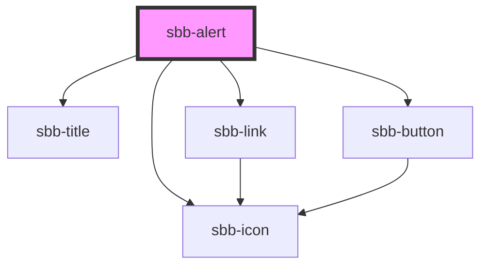

The alert component should be used to display important messages to a client. 
There are two sizes available and a `sbb-alert` can optionally be hidden by a user. 
It's possible to place an action, which by clicking navigates somewhere to display more information.

**Note:** Clicking on the close button does not remove it from the DOM, this would be in responsibility
of the library consumer to do it by reacting to the specific event. 
See also the `sbb-alert-group` which automatically removes an alert after clicking the close button.

## Accessibility

The description text is wrapped into an `<p>` element to guarantee the semantic meaning. 
Avoid slotting block elements (e.g. `<div>`) as this violates semantic rules and can have negative effects on screen readers.

## Usage

Default with link:

```html
<sbb-alert title-content='Interruption between Berne and Olten' icon-name='disruption' href='https://www.sbb.ch'>
  Between Bern and Olten from 03.11.2021 to 05.12.2022 each time from 22:30 to 06:00 o'clock 
  construction work will take place. 
  You have to expect changed travel times and changed connections.
</sbb-alert>
```

Without link:

```html
<sbb-alert title-content='Interruption between Berne and Olten'>
  Between Bern and Olten from 03.11.2021 to 05.12.2022 each time from 22:30 to 06:00 o'clock 
  construction work will take place. 
  You have to expect changed travel times and changed connections.
</sbb-alert>
```

Readonly (no close button):

```html
<sbb-alert title-content='Interruption between Berne and Olten' readonly>
  Between Bern and Olten from 03.11.2021 to 05.12.2022 each time from 22:30 to 06:00 o'clock 
  construction work will take place. 
  You have to expect changed travel times and changed connections.
</sbb-alert>
```

Slot variant:

```html
<sbb-alert href='https://www.sbb.ch'>
  <span slot='title'>Interruption between Berne and Olten</span>
  <sbb-icon slot='icon' name='disruption'></sbb-icon>
  Between Bern and Olten from 03.11.2021 to 05.12.2022 each time from 22:30 to 06:00 o'clock 
  construction work will take place. 
  You have to expect changed travel times and changed connections.
</sbb-alert>
```

## Accessibility

Accessibility is mainly done by wrapping the alerts into the `sbb-alert-group`.


<!-- Auto Generated Below -->


## Properties

| Property             | Attribute             | Description                                                                                                                                                               | Type                                     | Default     |
| -------------------- | --------------------- | ------------------------------------------------------------------------------------------------------------------------------------------------------------------------- | ---------------------------------------- | ----------- |
| `accessibilityLabel` | `accessibility-label` | This will be forwarded as aria-label to the relevant nested element.                                                                                                      | `string`                                 | `undefined` |
| `disableAnimation`   | `disable-animation`   | Whether the fade in animation should be disabled.                                                                                                                         | `boolean`                                | `false`     |
| `href`               | `href`                | The href value you want to link to.                                                                                                                                       | `string`                                 | `undefined` |
| `iconName`           | `icon-name`           | Name of the icon which will be forward to the nested `sbb-icon`. Choose the icons from https://lyne.sbb.ch/tokens/icons/. Styling is optimized for icons of type HIM-CUS. | `string`                                 | `undefined` |
| `linkContent`        | `link-content`        | Content of the link.                                                                                                                                                      | `string`                                 | `undefined` |
| `readonly`           | `readonly`            | Whether the alert is readonly. In readonly mode, there is no dismiss button offered to the user.                                                                          | `boolean`                                | `false`     |
| `rel`                | `rel`                 | The relationship of the linked URL as space-separated link types.                                                                                                         | `string`                                 | `undefined` |
| `size`               | `size`                | You can choose between `m` or `l` size.                                                                                                                                   | `"l" \| "m"`                             | `'m'`       |
| `target`             | `target`              | Where to display the linked URL.                                                                                                                                          | `string`                                 | `undefined` |
| `titleContent`       | `title-content`       | Content of title.                                                                                                                                                         | `string`                                 | `undefined` |
| `titleLevel`         | `title-level`         | Level of title, will be rendered as heading tag (e.g. h3). Defaults to level 3.                                                                                           | `"1" \| "2" \| "3" \| "4" \| "5" \| "6"` | `'3'`       |


## Events

| Event                 | Description                                                        | Type                |
| --------------------- | ------------------------------------------------------------------ | ------------------- |
| `did-present`         | Emits when the fade in animation ends and the button is displayed. | `CustomEvent<void>` |
| `dismissal-requested` | Emits when dismissal of an alert was requested.                    | `CustomEvent<void>` |
| `will-present`        | Emits when the fade in animation starts.                           | `CustomEvent<void>` |


## Methods

### `requestDismissal() => Promise<void>`

Requests dismissal of the alert.

#### Returns

Type: `Promise<void>`


## Slots

| Slot        | Description                                                                                                |
| ----------- | ---------------------------------------------------------------------------------------------------------- |
| `"icon"`    | Should be a sbb-icon which is displayed next to the title. Styling is optimized for icons of type HIM-CUS. |
| `"title"`   | Title content.                                                                                             |
| `"unnamed"` | Content of the alert.                                                                                      |


## Dependencies

### Depends on

- [sbb-icon](../sbb-icon)
- [sbb-title](../sbb-title)
- [sbb-link](../sbb-link)
- [sbb-button](../sbb-button)

### Graph


----------------------------------------------


