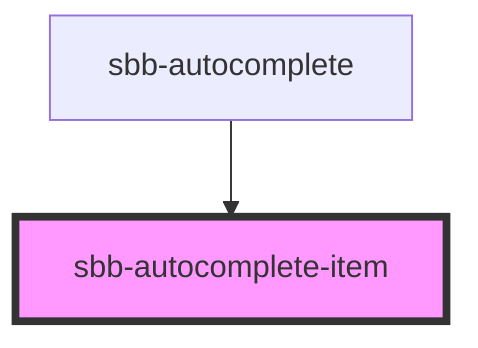

# sbb-autocomplete-item

<!-- Auto Generated Below -->

## Properties

| Property            | Attribute       | Description                                                                                     | Type      | Default     |
| ------------------- | --------------- | ----------------------------------------------------------------------------------------------- | --------- | ----------- |
| `ariaPosinset`      | `aria-posinset` | The aria-posinset attribute for the list element                                                | `number`  | `undefined` |
| `ariaSetsize`       | `aria-setsize`  | The aira-setsize attribute for the list element                                                 | `number`  | `undefined` |
| `highlight`         | `highlight`     | The text to highlight within the string property                                                | `string`  | `undefined` |
| `selected`          | `selected`      | Mark the item as selected, which will change it's appearance and the according aria attributes. | `boolean` | `undefined` |
| `text` _(required)_ | `text`          | Text to show as content of the autocomplete item                                                | `string`  | `undefined` |

## Slots

| Slot          | Description                                            |
| ------------- | ------------------------------------------------------ |
| `"post-text"` | placeholder to put content inline after the item text  |
| `"pre-text"`  | placeholder to put content inline before the item text |

## Dependencies

### Used by

- [sbb-autocomplete](../sbb-autocomplete)

### Graph

---
