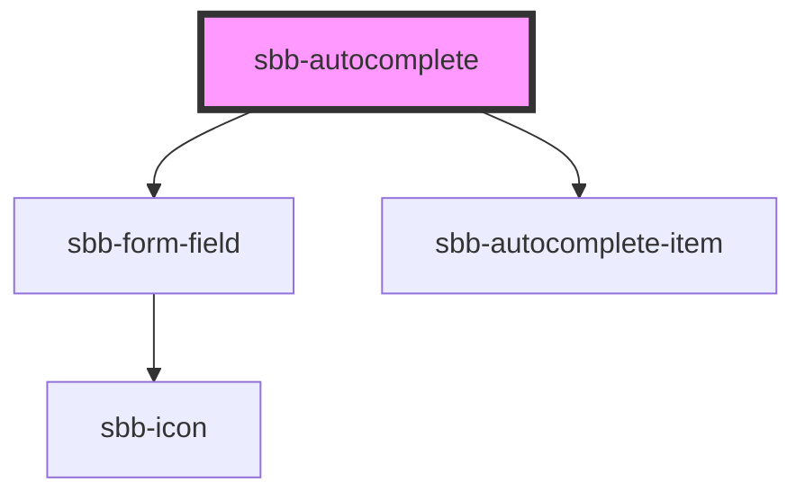

# sbb-autocomplete

<!-- Auto Generated Below -->

## Properties

| Property                  | Attribute                | Description                                                                                                                                                       | Type      | Default     |
| ------------------------- | ------------------------ | ----------------------------------------------------------------------------------------------------------------------------------------------------------------- | --------- | ----------- |
| `eventId`                 | `event-id`               | Id which is sent as the id in the eventDetail payload when a value is selected                                                                                    | `string`  | `undefined` |
| `inputBorderless`         | `input-borderless`       | Define if borderless variant of autocomplete input should be used. See documentation of sbb-text-input for details.                                               | `boolean` | `undefined` |
| `inputDebounceTimeout`    | `input-debounce-timeout` | Debounce timeout to use for the input. See documentation of sbb-text-input for details.                                                                           | `number`  | `200`       |
| `inputLabel` _(required)_ | `input-label`            | Label attribute for the input element. See sbb-text-input for details.                                                                                            | `string`  | `undefined` |
| `inputLabelVisible`       | `input-label-visible`    | Determine if the input label should be visible. See sbb-text-input for details.                                                                                   | `boolean` | `undefined` |
| `inputName` _(required)_  | `input-name`             | Name attribute for the input element. See sbb-text-input for details.                                                                                             | `string`  | `undefined` |
| `inputPlaceholder`        | `input-placeholder`      | Placeholder attribute for the input element. See sbb-text-input for details.                                                                                      | `string`  | `undefined` |
| `items`                   | `items`                  | Items to show in the autocomplete interface. You should pass a stringified array of objects, containing the `text` key for each object with an appropriate value. | `string`  | `undefined` |
| `minChars`                | `min-chars`              | Define how many chars a user must type into the input field for the autocomplete list to show up.                                                                 | `number`  | `0`         |
| `value`                   | `value`                  | The value to use as default value for the input. The input value or the selected autocomplete value is reflected to this attribute.                               | `string`  | `undefined` |

## Dependencies

### Depends on

- [sbb-form-field](../sbb-form-field)
- [sbb-autocomplete-item](../sbb-autocomplete-item)

### Graph

----------------------------------------------

