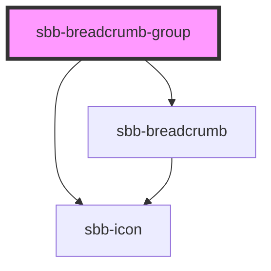

The `sbb-breadcrumb-group` component is a container for one or more `sbb-breadcrumb`,
which are meant to represent the hierarchy of visited pages before arriving to the current one.

If the width of all the nested breadcrumbs exceeds the container width, only the first and the last breadcrumb are displayed,
and a new one with the ellipsis symbol appears between them. 
Clicking on this breadcrumb will make it disappear and will restore the full list (the action is not reversible).

## Usage

`sbb-breadcrumb-group` with home icon as first `sbb-breadcrumb`:

```html
<sbb-breadcrumb-group>
  <sbb-breadcrumb href='/' icon-name='house-small'></sbb-breadcrumb>
  <sbb-breadcrumb href='/workwithus'>
    Work with us
  </sbb-breadcrumb>
  <sbb-breadcrumb href='/apply' target='_blank'>
    Apply
  </sbb-breadcrumb>
</sbb-breadcrumb-group>
```

<!-- Auto Generated Below -->


## Slots

| Slot        | Description                          |
| ----------- | ------------------------------------ |
| `"unnamed"` | Use this to slot the sbb-breadcrumb. |


## Dependencies

### Depends on

- [sbb-icon](../sbb-icon)
- [sbb-breadcrumb](../sbb-breadcrumb)

### Graph


----------------------------------------------


