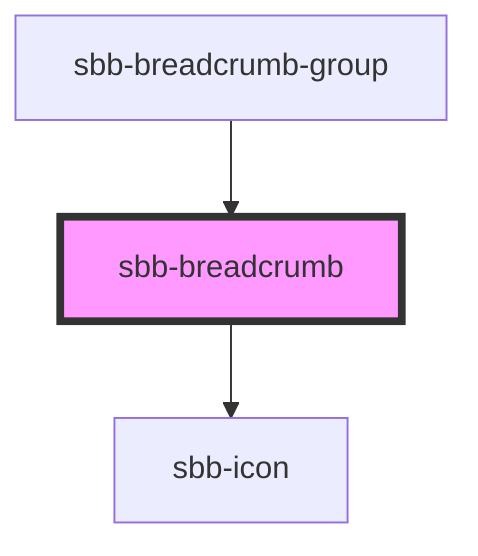

The `sbb-breadcrumb` is a component used to display a link to a page; 
used within a `sbb-breadcrumb-group`, it can display the list of the links the used visited to arrive at the current page.

It is possible to provide a text via an unnamed slot; the component can optionally display a `<sbb-icon>`
at the component start using the `iconName` property or via custom content using the `icon` slot.
Text and icon are not exclusive and can be used together.

It's possible to set all the link related properties (`download`, `href`, `rel` and `target`);
the `ariaCurrent` is used to make the breadcrumb read correctly by screen-readers when the componentn
is used in a `sbb-breadcrumb-group`.

## Usage

Breadcrumb with text:

```html
<sbb-breadcrumb href='/contact' target='_blank'>
  Contact us
</sbb-breadcrumb>
```

Breadcrumb with text and slotted icon:

```html
<sbb-breadcrumb href='/download' download icon-name='download-small'></sbb-breadcrumb>
```

Breadcrumb with text and slotted icon:

```html
<sbb-breadcrumb href='/info' target='_blank' rel='help'>
  Info
  <sbb-icon slot="icon" name="circle-information-small"></sbb-icon>
</sbb-breadcrumb>
```

<!-- Auto Generated Below -->


## Properties

| Property      | Attribute      | Description                                                                                                                                                                     | Type      | Default     |
| ------------- | -------------- | ------------------------------------------------------------------------------------------------------------------------------------------------------------------------------- | --------- | ----------- |
| `ariaCurrent` | `aria-current` |                                                                                                                                                                                 | `string`  | `undefined` |
| `download`    | `download`     | Whether the browser will show the download dialog on click.                                                                                                                     | `boolean` | `undefined` |
| `href`        | `href`         | The href value you want to link to.                                                                                                                                             | `string`  | `undefined` |
| `iconName`    | `icon-name`    | The icon name we want to use, choose from the small icon variants from the ui-icons category from here https://lyne.sbb.ch/tokens/icons/. Inline variant doesn't support icons. | `string`  | `undefined` |
| `rel`         | `rel`          | The relationship of the linked URL as space-separated link types.                                                                                                               | `string`  | `undefined` |
| `target`      | `target`       | Where to display the linked URL.                                                                                                                                                | `string`  | `undefined` |


## Slots

| Slot        | Description                                |
| ----------- | ------------------------------------------ |
| `"icon"`    | Use this to display an icon as breadcrumb. |
| `"unnamed"` | Use this to slot the breadcrumb's text.    |


## Dependencies

### Used by

 - [sbb-breadcrumb-group](../sbb-breadcrumb-group)

### Depends on

- [sbb-icon](../sbb-icon)

### Graph


----------------------------------------------


