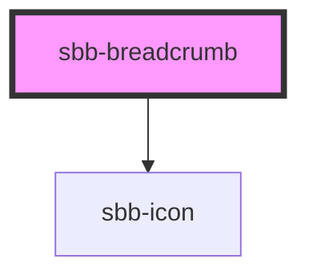

The `sbb-breadcrumb` is a component used to display a link to a page; when it's used within the `sbb-breadcrumb-group` component, 
it can display the list of the links the user visited to arrive at the current page.

### Slots

It is possible to provide a text via an unnamed slot; the component can optionally display a `<sbb-icon>`
at the component start using the `iconName` property or via custom content using the `icon` slot.
Text and icon are not exclusive and can be used together.

Breadcrumb with text:

```html
<sbb-breadcrumb href='/contact' target='_blank'>Contact us</sbb-breadcrumb>
```

Breadcrumb with icon:

```html
<sbb-breadcrumb href='/book-your-trip' icon-name='travel-backpack-medium'></sbb-breadcrumb>
```

Breadcrumb with text and slotted icon:

```html
<sbb-breadcrumb href='/info' target='_blank' rel='help'>
  Info
  <sbb-icon slot="icon" name="circle-information-small"></sbb-icon>
</sbb-breadcrumb>
```

### Link

It's possible to set all the link related properties (`download`, `href`, `rel` and `target`).

## Accessibility 
The `aria-current` property should be used to make the breadcrumb read correctly by screen-readers when the component
is used in the `sbb-breadcrumb-group`.
By default, the `sbb-breadcrumb-group` component sets `aria-current="page"` on the last slotted `sbb-breadcrumb`.

<!-- Auto Generated Below -->


## Properties

| Property   | Attribute   | Description                                                                                                                      | Type      | Default     |
| ---------- | ----------- | -------------------------------------------------------------------------------------------------------------------------------- | --------- | ----------- |
| `download` | `download`  | Whether the browser will show the download dialog on click.                                                                      | `boolean` | `undefined` |
| `href`     | `href`      | The href value you want to link to.                                                                                              | `string`  | `undefined` |
| `iconName` | `icon-name` | The icon name we want to use, choose from the small icon variants from the ui-icons category from here https://icons.app.sbb.ch. | `string`  | `undefined` |
| `rel`      | `rel`       | The relationship of the linked URL as space-separated link types.                                                                | `string`  | `undefined` |
| `target`   | `target`    | Where to display the linked URL.                                                                                                 | `string`  | `undefined` |


## Slots

| Slot        | Description                                |
| ----------- | ------------------------------------------ |
| `"icon"`    | Use this to display an icon as breadcrumb. |
| `"unnamed"` | Use this to slot the breadcrumb's text.    |


## Dependencies

### Depends on

- [sbb-icon](../sbb-icon)

### Graph


----------------------------------------------


