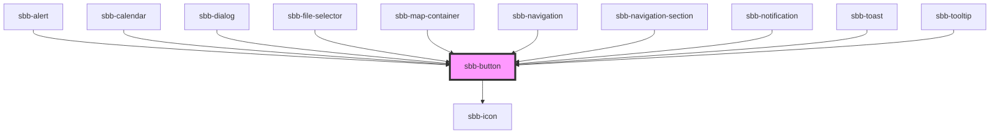

The `sbb-button` component provides the same functionality as a native `<button>` enhanced with the SBB Design.

```html
<sbb-button>Button text</sbb-button>
```

### Slots

The button text is provided via an unnamed slot; the component can optionally display a `sbb-icon`
at the component start using the `iconName` property or via custom content using the `icon` slot.
Neither is mandatory, so you can have a `sbb-button` with icon only, text only, or both.

```html
<sbb-button icon-name="info">Button text</sbb-button>

<sbb-button>
  <sbb-icon slot="icon" name="info"></sbb-icon>
  Button text
</sbb-button>

<sbb-button icon-name="info" aria-label='Click for more information.'></sbb-button>
```

### Link/button properties

The component can be internally rendered as a button or as a link,
depending on the value of the `href` property, so the associated properties are available
(`href`, `target`, `rel` and `download` for link; `type`, `name`, `value` and `form` for button).
If `isStatic` is set, the component will be rendered as a button without any user interaction.
Please note that if the `sbb-button` is placed inside another anchor or button tag,
it is internally rendered as a span in order to not break HTML functionality.
If the component is placed inside an `sbb-form-field`, it renders with the correct styling.

```html
<sbb-button href="https://github.com/lyne-design-system/lyne-components" target='_blank'>
  Go to site
</sbb-button>

<sbb-button type='button' name='tickets' form='buy' value='tickets'>
  Buy tickets
</sbb-button>
```

### Style

The component has four color variants that can be set using the `variant` property (default: `primary`),
and it has also a negative one which can be set using the `negative` property.

There are two different sizes (`m` and `l`, which is the default) that can be set using the `size` property.

The component can be displayed in `disabled` state using the self-named property.

```html
<sbb-button variant='secondary'>Button</sbb-button>
<sbb-button variant='tertiary'>Button</sbb-button>
<sbb-button variant='transparent'>Button</sbb-button>

<sbb-button size='m'>Button</sbb-button>

<sbb-button disabled>Button</sbb-button>
```

### Focus outline

Please make sure that the focus outline appears in the correct color if the component is used on a dark background.
You can set it by re-defining the css var on `sbb-button` or any parent element:

```css
sbb-button {
  --sbb-focus-outline-color: var(--sbb-focus-outline-color-dark);
}
```

## Accessibility

Use the accessibility properties in case of an icon only button to describe the purpose of the `sbb-button` for screen reader users.

<!-- Auto Generated Below -->


## Properties

| Property   | Attribute   | Description                                                                                                                                            | Type                                                      | Default     |
| ---------- | ----------- | ------------------------------------------------------------------------------------------------------------------------------------------------------ | --------------------------------------------------------- | ----------- |
| `disabled` | `disabled`  | Whether the button is disabled.                                                                                                                        | `boolean`                                                 | `false`     |
| `download` | `download`  | Whether the browser will show the download dialog on click.                                                                                            | `boolean`                                                 | `undefined` |
| `form`     | `form`      | The <form> element to associate the button with.                                                                                                       | `string`                                                  | `undefined` |
| `href`     | `href`      | The href value you want to link to (if it is present, button becomes a link).                                                                          | `string`                                                  | `undefined` |
| `iconName` | `icon-name` | The icon name we want to use, choose from the small icon variants from the ui-icons category from here https://icons.app.sbb.ch.                       | `string`                                                  | `undefined` |
| `isStatic` | `is-static` | Set this property to true if you want only a visual representation of a button, but no interaction (a span instead of a link/button will be rendered). | `boolean`                                                 | `false`     |
| `name`     | `name`      | The name attribute to use for the button.                                                                                                              | `string`                                                  | `undefined` |
| `negative` | `negative`  | Negative coloring variant flag.                                                                                                                        | `boolean`                                                 | `false`     |
| `rel`      | `rel`       | The relationship of the linked URL as space-separated link types.                                                                                      | `string`                                                  | `undefined` |
| `size`     | `size`      | Size variant, either l or m.                                                                                                                           | `"l" \| "m"`                                              | `'l'`       |
| `target`   | `target`    | Where to display the linked URL.                                                                                                                       | `string`                                                  | `undefined` |
| `type`     | `type`      | The type attribute to use for the button.                                                                                                              | `"button" \| "reset" \| "submit"`                         | `undefined` |
| `value`    | `value`     | The value attribute to use for the button.                                                                                                             | `string`                                                  | `undefined` |
| `variant`  | `variant`   | Variant of the button, like primary, secondary etc.                                                                                                    | `"primary" \| "secondary" \| "tertiary" \| "transparent"` | `'primary'` |


## Slots

| Slot        | Description                                  |
| ----------- | -------------------------------------------- |
| `"icon"`    | Slot used to display the icon, if one is set |
| `"unnamed"` | Button Content                               |


## Dependencies

### Used by

 - [sbb-alert](../sbb-alert)
 - [sbb-calendar](../sbb-calendar)
 - [sbb-dialog](../sbb-dialog)
 - [sbb-file-selector](../sbb-file-selector)
 - [sbb-map-container](../sbb-map-container)
 - [sbb-navigation](../sbb-navigation)
 - [sbb-navigation-section](../sbb-navigation-section)
 - [sbb-notification](../sbb-notification)
 - [sbb-toast](../sbb-toast)
 - [sbb-tooltip](../sbb-tooltip)

### Depends on

- [sbb-icon](../sbb-icon)

### Graph


----------------------------------------------


