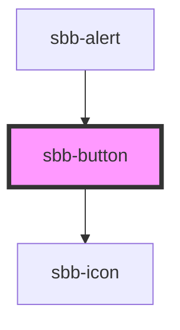

# sbb-button

The `<sbb-button>` implements the design of the Lyne Button. It can both be used as a `<button>` or as a `<a>` (if the 
href property is set). If the `<sbb-button>` is placed inside another or button tag, it is internally rendered as a 
`<span>` in order to not break HTML structure.

## Usage
Simple button
```html
<sbb-button>Button text</sbb-button>
```

Button with icon
```html
<sbb-button icon-name="info">Button text</sbb-button>
```

Button with slotted icon
```html
<sbb-button>
    <sbb-icon slot="icon" name="info"></sbb-icon>
    Button text
</sbb-button>
```

## Accessibility
Use the accessibility-label attribute in case of an icon only button to describe the purpose of the button for screen readers.

<!-- Auto Generated Below -->


## Properties

| Property                   | Attribute                   | Description                                                                                                                                                                                                                     | Type                                                            | Default     |
| -------------------------- | --------------------------- | ------------------------------------------------------------------------------------------------------------------------------------------------------------------------------------------------------------------------------- | --------------------------------------------------------------- | ----------- |
| `accessibilityControls`    | `accessibility-controls`    | When an interaction of this button has an impact on another element(s) in the document, the id of that element(s) needs to be set. The value will be forwarded to the 'aria-controls' attribute to the relevant nested element. | `string`                                                        | `undefined` |
| `accessibilityDescribedby` | `accessibility-describedby` | This will be forwarded as aria-describedby to the relevant nested element.                                                                                                                                                      | `string`                                                        | `undefined` |
| `accessibilityHasPopup`    | `accessibility-has-popup`   | If you use the button to trigger another widget which itself is covering the page, you must provide an according attribute for aria-haspopup.                                                                                   | `"dialog" \| "grid" \| "listbox" \| "menu" \| "tree" \| "true"` | `undefined` |
| `accessibilityLabel`       | `accessibility-label`       | This will be forwarded as aria-label to the relevant nested element.                                                                                                                                                            | `string`                                                        | `undefined` |
| `accessibilityLabelledby`  | `accessibility-labelledby`  | This will be forwarded as aria-labelledby to the relevant nested element.                                                                                                                                                       | `string`                                                        | `undefined` |
| `disabled`                 | `disabled`                  | Set to true to get a disabled button                                                                                                                                                                                            | `boolean`                                                       | `false`     |
| `href`                     | `href`                      | The href value you want to link to                                                                                                                                                                                              | `string`                                                        | `undefined` |
| `iconName`                 | `icon-name`                 | The icon name we want to use, choose from the small icon variants from the ui-icons category from here https://lyne.sbb.ch/tokens/icons/ (optional). Inline variant doesn't support icons.                                      | `string`                                                        | `undefined` |
| `isStatic`                 | `static`                    | Set this property to true if you want only a visual representation of a button, but no interaction (a span instead of a button will be rendered).                                                                               | `boolean`                                                       | `false`     |
| `name`                     | `name`                      | The name attribute to use for the button                                                                                                                                                                                        | `string`                                                        | `undefined` |
| `negative`                 | `negative`                  | Negative coloring variant flag                                                                                                                                                                                                  | `boolean`                                                       | `undefined` |
| `size`                     | `size`                      | Size variant, either l or m.                                                                                                                                                                                                    | `"l" \| "m"`                                                    | `'l'`       |
| `type`                     | `type`                      | The type attribute to use for the button                                                                                                                                                                                        | `"button" \| "reset" \| "submit"`                               | `undefined` |
| `value`                    | `value`                     | The value attribute to use for the button                                                                                                                                                                                       | `string`                                                        | `undefined` |
| `variant`                  | `variant`                   | Variant of the button, like primary, secondary etc.                                                                                                                                                                             | `"primary" \| "secondary" \| "translucent" \| "transparent"`    | `'primary'` |


## Events

| Event              | Description                                            | Type               |
| ------------------ | ------------------------------------------------------ | ------------------ |
| `sbb-button_click` | Emits whenever the native button click event triggers. | `CustomEvent<any>` |


## Dependencies

### Used by

 - [sbb-alert](../sbb-alert)

### Depends on

- [sbb-icon](../sbb-icon)

### Graph


----------------------------------------------