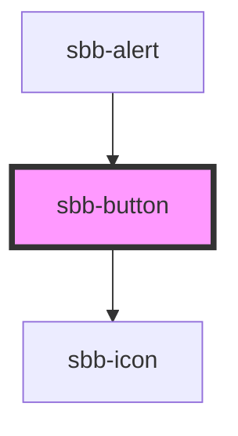

# sbb-button

The `<sbb-button>` implements the design of the Lyne Button. If the `href` property is set, it will internally be rendered as link, otherwise as a button.
If the `<sbb-button>` is placed inside another action element (e.g. button, link, ...),
it is internally rendered as a `<span>` in order to not break HTML structure. 
It's also possible to set the `<sbb-button>` manually into static state by applying `static` property.

## Usage
Simple button
```html
<sbb-button>Button text</sbb-button>
```

Button with icon
```html
<sbb-button icon-name="info">Button text</sbb-button>
```

Button with slotted icon
```html
<sbb-button>
  <sbb-icon slot="icon" name="info"></sbb-icon>
  Button text
</sbb-button>
```

## Accessibility
Use the accessibility properties in case of an icon only button to describe the purpose of the button for screen reader users.

### Focus outline
Please make sure, that the focus outline appears in the correct color if using on a dark background.
You can set it by re-defining the css var on `sbb-button` or any parent element:

```css
sbb-button {
  --sbb-focus-outline-color: var(--sbb-focus-outline-color-dark);
}
```

<!-- Auto Generated Below -->


## Properties

| Property                   | Attribute                   | Description                                                                                                                                                                                                                     | Type                                                            | Default     |
| -------------------------- | --------------------------- | ------------------------------------------------------------------------------------------------------------------------------------------------------------------------------------------------------------------------------- | --------------------------------------------------------------- | ----------- |
| `accessibilityControls`    | `accessibility-controls`    | When an interaction of this button has an impact on another element(s) in the document, the id of that element(s) needs to be set. The value will be forwarded to the 'aria-controls' attribute to the relevant nested element. | `string`                                                        | `undefined` |
| `accessibilityDescribedby` | `accessibility-describedby` | This will be forwarded as aria-describedby to the relevant nested element.                                                                                                                                                      | `string`                                                        | `undefined` |
| `accessibilityHaspopup`    | `accessibility-haspopup`    | If you use the button to trigger another widget which itself is covering the page, you must provide an according attribute for aria-haspopup.                                                                                   | `"dialog" \| "grid" \| "listbox" \| "menu" \| "tree" \| "true"` | `undefined` |
| `accessibilityLabel`       | `accessibility-label`       | This will be forwarded as aria-label to the relevant nested element.                                                                                                                                                            | `string`                                                        | `undefined` |
| `accessibilityLabelledby`  | `accessibility-labelledby`  | This will be forwarded as aria-labelledby to the relevant nested element.                                                                                                                                                       | `string`                                                        | `undefined` |
| `disabled`                 | `disabled`                  | Whether the button is disabled.                                                                                                                                                                                                 | `boolean`                                                       | `false`     |
| `download`                 | `download`                  | Whether the browser will show the download dialog on click.                                                                                                                                                                     | `boolean`                                                       | `undefined` |
| `form`                     | `form`                      | The <form> element to associate the button with.                                                                                                                                                                                | `string`                                                        | `undefined` |
| `href`                     | `href`                      | The href value you want to link to (if it is present, button becomes a link).                                                                                                                                                   | `string`                                                        | `undefined` |
| `iconName`                 | `icon-name`                 | The icon name we want to use, choose from the small icon variants from the ui-icons category from here https://lyne.sbb.ch/tokens/icons/.                                                                                       | `string`                                                        | `undefined` |
| `idValue`                  | `id-value`                  | Pass in an id, if you need to identify the inner element.                                                                                                                                                                       | `string`                                                        | `undefined` |
| `isStatic`                 | `static`                    | Set this property to true if you want only a visual representation of a button, but no interaction (a span instead of a link/button will be rendered).                                                                          | `boolean`                                                       | `false`     |
| `name`                     | `name`                      | The name attribute to use for the button.                                                                                                                                                                                       | `string`                                                        | `undefined` |
| `negative`                 | `negative`                  | Negative coloring variant flag.                                                                                                                                                                                                 | `boolean`                                                       | `false`     |
| `rel`                      | `rel`                       | The relationship of the linked URL as space-separated link types.                                                                                                                                                               | `string`                                                        | `undefined` |
| `size`                     | `size`                      | Size variant, either l or m.                                                                                                                                                                                                    | `"l" \| "m"`                                                    | `'l'`       |
| `target`                   | `target`                    | Where to display the linked URL.                                                                                                                                                                                                | `string`                                                        | `undefined` |
| `type`                     | `type`                      | The type attribute to use for the button.                                                                                                                                                                                       | `"button" \| "reset" \| "submit"`                               | `undefined` |
| `value`                    | `value`                     | The value attribute to use for the button.                                                                                                                                                                                      | `string`                                                        | `undefined` |
| `variant`                  | `variant`                   | Variant of the button, like primary, secondary etc.                                                                                                                                                                             | `"primary" \| "secondary" \| "translucent" \| "transparent"`    | `'primary'` |


## Events

| Event              | Description                      | Type               |
| ------------------ | -------------------------------- | ------------------ |
| `sbb-button_click` | Emits the event on button click. | `CustomEvent<any>` |


## Slots

| Slot        | Description                                  |
| ----------- | -------------------------------------------- |
| `"icon"`    | Slot used to display the icon, if one is set |
| `"unnamed"` | Button Content                               |


## Dependencies

### Used by

 - [sbb-alert](../sbb-alert)

### Depends on

- [sbb-icon](../sbb-icon)

### Graph


----------------------------------------------


