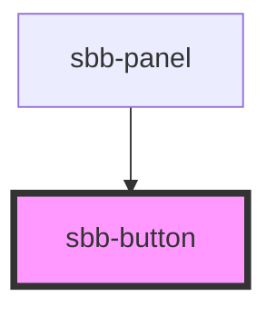

# sbb-button

<!-- Auto Generated Below -->

## Properties

| Property           | Attribute            | Description                                                                                                                                                                                | Type                                                            | Default     |
| ------------------ | -------------------- | ------------------------------------------------------------------------------------------------------------------------------------------------------------------------------------------ | --------------------------------------------------------------- | ----------- |
| `ariaHaspopup`     | `aria-haspopup`      | If you use the button to trigger another widget which itself is covering the page, you must provide an according attribute for aria-haspopup.                                              | `"dialog" \| "grid" \| "listbox" \| "menu" \| "tree" \| "true"` | `undefined` |
| `buttonType`       | `button-type`        | The type attribute to use for the button                                                                                                                                                   | `"button" \| "reset" \| "submit"`                               | `'button'`  |
| `disabled`         | `disabled`           | Set to true to get a disabled button                                                                                                                                                       | `boolean`                                                       | `false`     |
| `eventId`          | `event-id`           | Id which is sent in the click event payload                                                                                                                                                | `string`                                                        | `undefined` |
| `href`             | `href`               | The href value you want to link to                                                                                                                                                         | `string`                                                        | `undefined` |
| `icon`             | `icon`               | Define if icon should be shown or not                                                                                                                                                      | `boolean`                                                       | `true`      |
| `iconDescription`  | `icon-description`   | If you use an icon without a label, you must provide an iconDescription                                                                                                                    | `string`                                                        | `undefined` |
| `iconName`         | `icon-name`          | The icon name we want to use, choose from the small icon variants from the ui-icons category from here https://lyne.sbb.ch/tokens/icons/ (optional). Inline variant doesn't support icons. | `string`                                                        | `undefined` |
| `iconOnly`         | `icon-only`          | set as icon-only, no label, no text                                                                                                                                                        | `boolean`                                                       | `false`     |
| `name`             | `name`               | The name attribute to use for the button                                                                                                                                                   | `string`                                                        | `undefined` |
| `negative`         | `negative`           | Negative coloring variant flag                                                                                                                                                             | `boolean`                                                       | `undefined` |
| `size`             | `size`               | Size variant, either l or m.                                                                                                                                                               | `"l" \| "m"`                                                    | `'l'`       |
| `type`             | `type`               |                                                                                                                                                                                            | `"a" \| "button" \| "span"`                                     | `'button'`  |
| `value`            | `value`              | The value attribute to use for the button                                                                                                                                                  | `string`                                                        | `undefined` |
| `variant`          | `variant`            | Variant of the button, like primary, secondary etc.                                                                                                                                        | `"primary" \| "secondary" \| "translucent" \| "transparent"`    | `'primary'` |
| `visualButtonOnly` | `visual-button-only` | Set this property to true if you want only a visual representation of a button, but no interaction (a div instead of a button will be rendered).                                           | `boolean`                                                       | `undefined` |

## Events

| Event              | Description                                                                                                               | Type               |
| ------------------ | ------------------------------------------------------------------------------------------------------------------------- | ------------------ |
| `sbb-button_click` | Emits whenever the native button click event triggers. TODO: Switch to a better event type during refactoring sbb-button. | `CustomEvent<any>` |

## Dependencies

### Used by

 - [sbb-panel](../sbb-panel)

### Graph

----------------------------------------------

