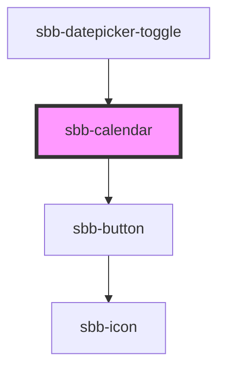

# sbb-calendar

The `sbb-calendar` component displays a calendar that allows the user to select a date. For accessibility purposes it's rendered as a native table element and each day is a button. 

While being deeply linked to the implementation of the `sbb-datepicker-toggle` component, it can be used on its own.

For date inputs (`min`, `max`, `selected-date`) the accepted formats are: 
- Date objects
- ISO String 
- Unix Timestamp (number of seconds since 1 Jan 1970)

and it's recommended to set the time at 00:00:00.
## Accessibility

Keyboard navigation summary:
- Arrow keys: move between days
- Home key: jumps to the first day of the month
- End key: jumps to the last day of the month
- Page Up key: jumps to the top of the column of the currently selected day
- Page Down key: jumps to the bottom of the column of the currently selected day

## Usage

```html
<sbb-calendar 
  min="1600000000" 
  max="1700000000" 
  selected-date="1650000000"
></sbb-calendar>
```

<!-- Auto Generated Below -->


## Properties

| Property       | Attribute       | Description                              | Type                       | Default      |
| -------------- | --------------- | ---------------------------------------- | -------------------------- | ------------ |
| `dateFilter`   | --              | A function used to filter out dates.     | `(date: Date) => boolean`  | `() => true` |
| `max`          | `max`           | The maximum valid date.                  | `Date \| number \| string` | `undefined`  |
| `min`          | `min`           | The minimum valid date.                  | `Date \| number \| string` | `undefined`  |
| `selectedDate` | `selected-date` | The selected date.                       | `Date \| number \| string` | `undefined`  |
| `wide`         | `wide`          | If set to true, two months are displayed | `boolean`                  | `false`      |


## Events

| Event           | Description                      | Type                |
| --------------- | -------------------------------- | ------------------- |
| `date-selected` | Event emitted on date selection. | `CustomEvent<Date>` |


## Methods

### `focusCell() => Promise<void>`

Focuses on a day cell prioritizing the selected day, the current day, and lastly the first selectable day.

#### Returns

Type: `Promise<void>`


### `resetPosition() => Promise<void>`

Resets the active month according to the new state of the calendar.

#### Returns

Type: `Promise<void>`


## Dependencies

### Used by

 - [sbb-datepicker-toggle](../sbb-datepicker-toggle)

### Depends on

- [sbb-button](../sbb-button)

### Graph


----------------------------------------------


