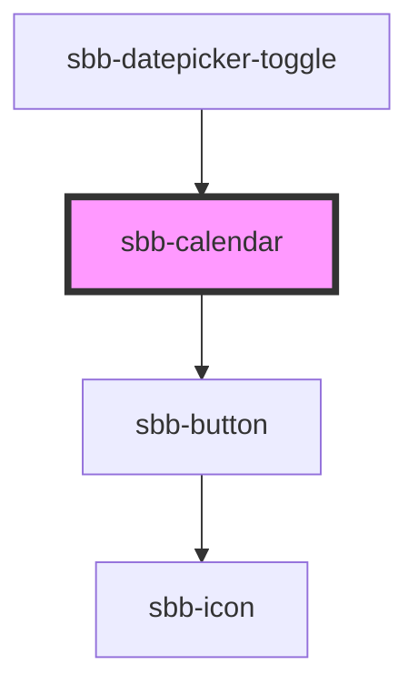

# sbb-calendar

<!-- Auto Generated Below -->

## Properties

| Property       | Attribute       | Description                              | Type                       | Default      |
| -------------- | --------------- | ---------------------------------------- | -------------------------- | ------------ |
| `dateFilter`   | --              | A function used to filter out dates.     | `(date: Date) => boolean`  | `() => true` |
| `max`          | `max`           | The maximum valid date.                  | `Date \| number \| string` | `undefined`  |
| `min`          | `min`           | The minimum valid date.                  | `Date \| number \| string` | `undefined`  |
| `selectedDate` | `selected-date` | The selected date.                       | `Date \| number \| string` | `undefined`  |
| `wide`         | `wide`          | If set to true, two months are displayed | `boolean`                  | `false`      |

## Events

| Event           | Description                      | Type                |
| --------------- | -------------------------------- | ------------------- |
| `date-selected` | Event emitted on date selection. | `CustomEvent<Date>` |

## Methods

### `focusCell() => Promise<void>`

Focuses on a day cell.

#### Returns

Type: `Promise<void>`

### `resetPosition() => Promise<void>`

Resets the active month according to the new state of the calendar.

#### Returns

Type: `Promise<void>`

## Dependencies

### Used by

 - [sbb-datepicker-toggle](../sbb-datepicker-toggle)

### Depends on

- [sbb-button](../sbb-button)

### Graph

----------------------------------------------

