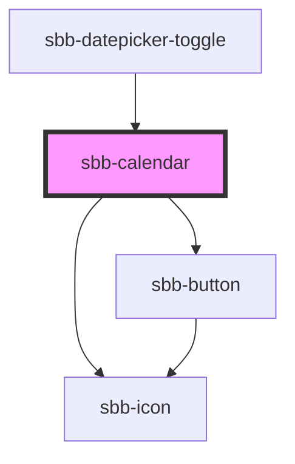

The `sbb-calendar` component displays a calendar that allows the user to select a date. 

While being deeply linked to the implementation of the [sbb-datepicker-toggle](/docs/components-sbb-datepicker-sbb-datepicker-toggle--docs) component, 
it can be used on its own.

```html
<sbb-calendar></sbb-calendar>
```

It's possible to set a date using the `dateSelected` property. Also, it's possible to place limits on the selection
using the two properties named `min` and `max`. For these three properties, the accepted formats are:

- Date objects
- ISO String
- Unix Timestamp (number of seconds since Jan 1, 1970)

It's recommended to set the time to 00:00:00.

```html
<sbb-calendar min="1600000000" max="1700000000" selected-date="1650000000"></sbb-calendar>
```

## Style

The component displays one month by default; two months can be displayed setting the `wide` property to `true`.

```html
<sbb-calendar wide='true' selected-date="1650000000"></sbb-calendar>
```

It's also possible to filter out unwanted date using the `dateFilter` function property.
Note that using the `dateFilter` function as a replacement for the `min` and `max` properties will most likely result in a significant loss of performance.

## Events

Consumers can listen to the `dateSelected` event on the `sbb-calendar` component to intercept the selected date 
which can be read from `event.detail`.

## Keyboard interaction

It's possible to move within the component using the keyboard.

| Keyboard               | Action                                                        |
|------------------------|---------------------------------------------------------------|
| <kbd>Left Arrow</kbd>  | Go to previous day.                                           |
| <kbd>Right Arrow</kbd> | Go to next day.                                               |
| <kbd>Up Arrow</kbd>    | Go to the same day in the previous week.                      |
| <kbd>Down Arrow</kbd>  | Go to the same day in the next week.                          |
| <kbd>Home</kbd>        | Go to the first day of the month.                             |
| <kbd>End</kbd>         | Go to the last day of the month.                              |
| <kbd>Page Up</kbd>     | Go to the top of the column of the currently selected day.    |
| <kbd>Page Down</kbd>   | Go to the bottom of the column of the currently selected day. |

## Accessibility

For accessibility purposes, the component is rendered as a native table element and each day is a button.

## Testing

To specify a specific date for the current datetime, you can use the `data-now` attribute (timestamp in milliseconds).
This is helpful if you need a specific state of the component.

<!-- Auto Generated Below -->


## Properties

| Property       | Attribute       | Description                                                                                                     | Type                       | Default      |
| -------------- | --------------- | --------------------------------------------------------------------------------------------------------------- | -------------------------- | ------------ |
| `dateFilter`   | --              | A function used to filter out dates.                                                                            | `(date: Date) => boolean`  | `() => true` |
| `max`          | `max`           | The maximum valid date. Takes Date Object, ISOString, and Unix Timestamp (number of seconds since Jan 1, 1970). | `Date \| number \| string` | `undefined`  |
| `min`          | `min`           | The minimum valid date. Takes Date Object, ISOString, and Unix Timestamp (number of seconds since Jan 1, 1970). | `Date \| number \| string` | `undefined`  |
| `selectedDate` | `selected-date` | The selected date. Takes Date Object, ISOString, and Unix Timestamp (number of seconds since Jan 1, 1970).      | `Date \| number \| string` | `undefined`  |
| `wide`         | `wide`          | If set to true, two months are displayed                                                                        | `boolean`                  | `false`      |


## Events

| Event           | Description                      | Type                |
| --------------- | -------------------------------- | ------------------- |
| `date-selected` | Event emitted on date selection. | `CustomEvent<Date>` |


## Methods

### `resetPosition() => Promise<void>`

Resets the active month according to the new state of the calendar.

#### Returns

Type: `Promise<void>`


## Dependencies

### Used by

 - [sbb-datepicker-toggle](../sbb-datepicker-toggle)

### Depends on

- [sbb-icon](../sbb-icon)
- [sbb-button](../sbb-button)

### Graph


----------------------------------------------


