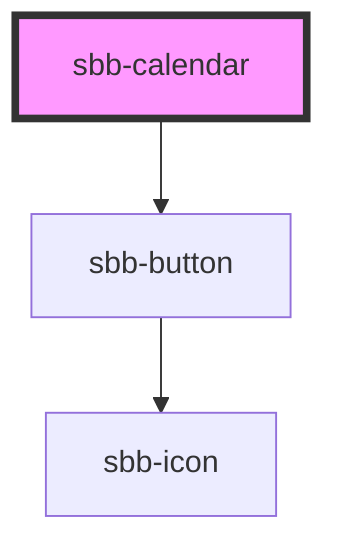

# sbb-calendar

<!-- Auto Generated Below -->

## Properties

| Property       | Attribute | Description                              | Type                      | Default     |
| -------------- | --------- | ---------------------------------------- | ------------------------- | ----------- |
| `dateFilter`   | --        | A function used to filter out dates.     | `(date: Date) => boolean` | `undefined` |
| `max`          | --        | The maximum valid date.                  | `Date`                    | `undefined` |
| `min`          | --        | The minimum valid date.                  | `Date`                    | `undefined` |
| `selectedDate` | --        | The selected date.                       | `Date`                    | `undefined` |
| `wide`         | `wide`    | If set to true, two months are displayed | `boolean`                 | `false`     |

## Events

| Event           | Description                      | Type                |
| --------------- | -------------------------------- | ------------------- |
| `date-selected` | Event emitted on date selection. | `CustomEvent<Date>` |

## Dependencies

### Depends on

- [sbb-button](../sbb-button)

### Graph

----------------------------------------------

