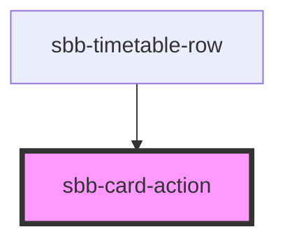

The `sbb-card-action` is the component used to turn a `sbb-card` into an action. 

```html
<sbb-card-action href="https://www.sbb.ch">Check all the wonderful trips available.</sbb-card-action>
```

### Link / button properties

As the [sbb-link](/docs/components-sbb-link--docs) and the [sbb-button](/docs/components-sbb-button--docs),
the component can be internally rendered as a button or as a link,
depending on the value of the `href` property, so the associated properties are available
(`href`, `target`, `rel` and `download` for link; `type`, `name`, `value` and `form` for button).

## Accessibility

It's **important** that a descriptive message is being slotted into the unnamed slot of `sbb-card-action`
as it is used for search engines and screen-reader users.

```html
<sbb-card-action>Buy a half-fare ticket now</sbb-card-action>
```


<!-- Auto Generated Below -->


## Properties

| Property   | Attribute  | Description                                                                     | Type                              | Default     |
| ---------- | ---------- | ------------------------------------------------------------------------------- | --------------------------------- | ----------- |
| `active`   | `active`   | Whether the card is active.                                                     | `boolean`                         | `false`     |
| `download` | `download` | Whether the browser will show the download dialog on click.                     | `boolean`                         | `undefined` |
| `form`     | `form`     | The <form> element to associate the button to it.                               | `string`                          | `undefined` |
| `href`     | `href`     | The href value you want to link to.                                             | `string`                          | `undefined` |
| `name`     | `name`     | The name of the button.                                                         | `string`                          | `undefined` |
| `rel`      | `rel`      | The relationship of the linked URL as space-separated link types.               | `string`                          | `undefined` |
| `target`   | `target`   | Where to display the linked URL.                                                | `string`                          | `undefined` |
| `type`     | `type`     | Default behaviour of the button.                                                | `"button" \| "reset" \| "submit"` | `undefined` |
| `value`    | `value`    | The value associated with button `name` when it's submitted with the form data. | `string`                          | `undefined` |


## Slots

| Slot        | Description                                                                                                         |
| ----------- | ------------------------------------------------------------------------------------------------------------------- |
| `"unnamed"` | Slot to render a descriptive label / title of the action (important!). This is relevant for SEO and screen readers. |


## Dependencies

### Used by

 - [sbb-timetable-row](../sbb-timetable-row)

### Graph


----------------------------------------------


