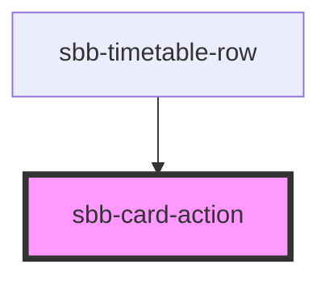

The `sbb-card-action` is the component to turn a `sbb-card` into an action. 

For full docs on how to use, see [sbb-card](/docs/components-sbb-card-sbb-card--docs) docs.

<!-- Auto Generated Below -->

## Properties

| Property   | Attribute  | Description                                                                     | Type                              | Default     |
| ---------- | ---------- | ------------------------------------------------------------------------------- | --------------------------------- | ----------- |
| `active`   | `active`   | Whether the card is active.                                                     | `boolean`                         | `false`     |
| `download` | `download` | Whether the browser will show the download dialog on click.                     | `boolean`                         | `undefined` |
| `form`     | `form`     | The <form> element to associate the button to it.                               | `string`                          | `undefined` |
| `href`     | `href`     | The href value you want to link to.                                             | `string`                          | `undefined` |
| `name`     | `name`     | The name of the button.                                                         | `string`                          | `undefined` |
| `rel`      | `rel`      | The relationship of the linked URL as space-separated link types.               | `string`                          | `undefined` |
| `target`   | `target`   | Where to display the linked URL.                                                | `string`                          | `undefined` |
| `type`     | `type`     | Default behaviour of the button.                                                | `"button" \| "reset" \| "submit"` | `undefined` |
| `value`    | `value`    | The value associated with button `name` when it's submitted with the form data. | `string`                          | `undefined` |

## Slots

| Slot        | Description                                                                                                         |
| ----------- | ------------------------------------------------------------------------------------------------------------------- |
| `"unnamed"` | Slot to render a descriptive label / title of the action (important!). This is relevant for SEO and screen readers. |

## Dependencies

### Used by

 - [sbb-timetable-row](../sbb-timetable-row)

### Graph

----------------------------------------------

