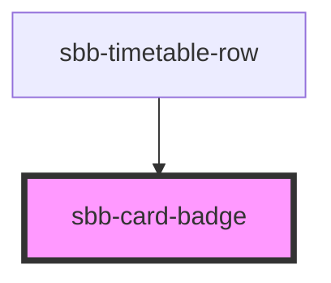

The `<sbb-card-badge>` can contain some information like prices or discounts and is 
e.g. used in `<sbb-card>` or `<sbb-selection-panel>`.

To achieve the correct spacing between elements inside the card badge, we recommend to use `<span>`-elements. 
All content parts are presented with a predefined gap in between.

```html
<sbb-card>
  <sbb-card-badge aria-label="Super saver sales ticket price starts at CHF 19.99">
    <span>%</span>
    <span>from CHF</span>
    <span>19.99</span>
  </sbb-card-badge>
  Card content...
</sbb-card>
```

## Accessibility

It's recommended to place an `aria-label` on `<sbb-card-badge>` to describe
the displayed information in a full sentence.

<!-- Auto Generated Below -->


## Properties

| Property | Attribute | Description              | Type                    | Default      |
| -------- | --------- | ------------------------ | ----------------------- | ------------ |
| `color`  | `color`   | Color of the card badge. | `"charcoal" \| "white"` | `'charcoal'` |


## Slots

| Slot        | Description                                                                                         |
| ----------- | --------------------------------------------------------------------------------------------------- |
| `"unnamed"` | Content of the badge. Content parts should be wrapped in `<span>` tags to achieve correct spacings. |


## Dependencies

### Used by

 - [sbb-timetable-row](../sbb-timetable-row)

### Graph


----------------------------------------------


